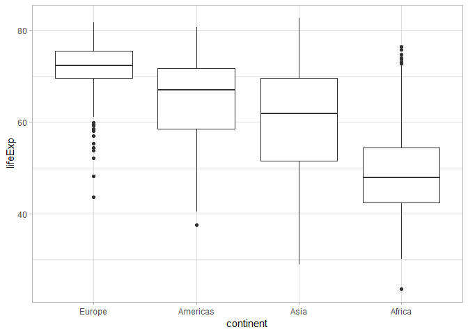
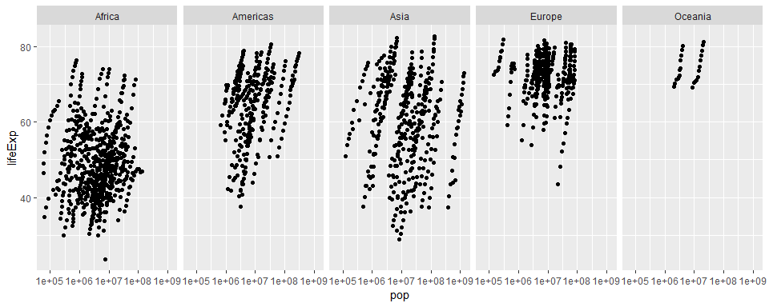
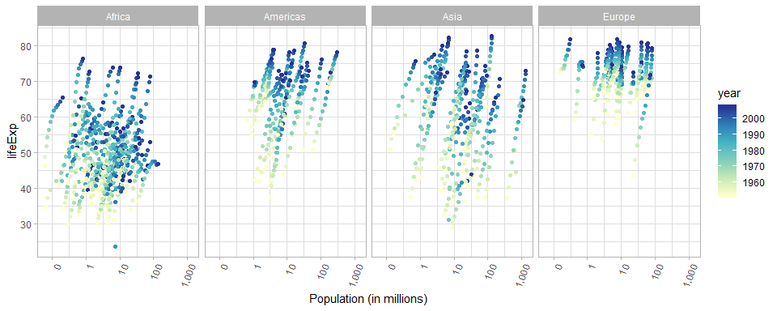
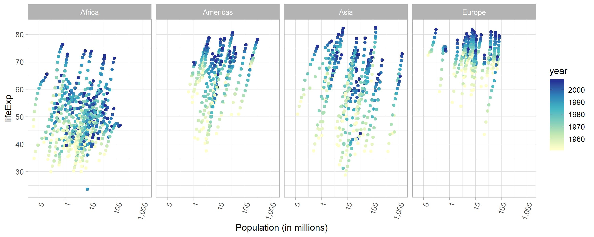
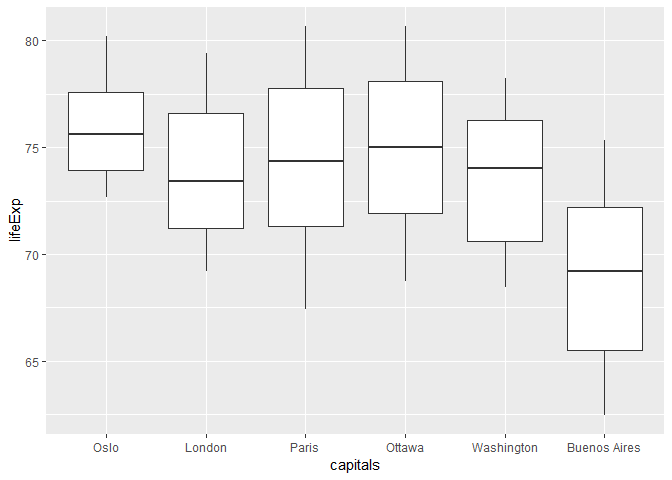

* [Introduction](#introduction)
    * [Load Packages](#load-packages)
* [Part 1: Factor Management](#part-1-factor-management)
* [Part 2: File I/O](#part-2-file-io)
* [Part 3: Visualization Design](#part-3-visualization-design)
    * [Remake a Past Figure](#remake-a-past-figure)
    * [Improving a Figure Using Plotly](#improving-a-figure-using-plotly)
* [Part 4: Writing Figures to File](#part-4-writing-figures-to-file)
* [But I Want to Do More!](#but-i-want-to-do-more)

## Introduction

Goals:

  * Reorder a factor in a principled way based on the data and demonstrate the effect in arranged data and in figures.
  * Write some data to file and load it back into R.
  * Improve a figure (or make one from scratch), using new knowledge, e.g., control the color scheme, use factor levels, smoother mechanics.
  * Make a plotly visual.
  * Implement visualization design principles.

### Load Packages


```r
library(tidyverse)
library(forcats)
library(gapminder)
library(scales)
library(plotly)
library(knitr)
```

## Part 1 Factor management

Elaboration for the gapminder data set
Drop Oceania. Filter the Gapminder data to remove observations associated with the continent of Oceania. Additionally, remove unused factor levels. Provide concrete information on the data before and after removing these rows and Oceania; address the number of rows and the levels of the affected factors.


```r
str(gapminder)
```

```
## Classes 'tbl_df', 'tbl' and 'data.frame':	1704 obs. of  6 variables:
##  $ country  : Factor w/ 142 levels "Afghanistan",..: 1 1 1 1 1 1 1 1 1 1 ...
##  $ continent: Factor w/ 5 levels "Africa","Americas",..: 3 3 3 3 3 3 3 3 3 3 ...
##  $ year     : int  1952 1957 1962 1967 1972 1977 1982 1987 1992 1997 ...
##  $ lifeExp  : num  28.8 30.3 32 34 36.1 ...
##  $ pop      : int  8425333 9240934 10267083 11537966 13079460 14880372 12881816 13867957 16317921 22227415 ...
##  $ gdpPercap: num  779 821 853 836 740 ...
```

We can see that:

  * There are 1704 rows
  * Country and continent are the only factor type variables, with 142 and 5 levels respectively.
  

```r
gapminderReduced <- gapminder %>% 
  filter(continent != "Oceania") %>% 
  mutate(country = fct_drop(country),
         continent = fct_drop(continent))

str(gapminderReduced)
```

```
## Classes 'tbl_df', 'tbl' and 'data.frame':	1680 obs. of  6 variables:
##  $ country  : Factor w/ 140 levels "Afghanistan",..: 1 1 1 1 1 1 1 1 1 1 ...
##  $ continent: Factor w/ 4 levels "Africa","Americas",..: 3 3 3 3 3 3 3 3 3 3 ...
##  $ year     : int  1952 1957 1962 1967 1972 1977 1982 1987 1992 1997 ...
##  $ lifeExp  : num  28.8 30.3 32 34 36.1 ...
##  $ pop      : int  8425333 9240934 10267083 11537966 13079460 14880372 12881816 13867957 16317921 22227415 ...
##  $ gdpPercap: num  779 821 853 836 740 ...
```

Now we can see that:

  * There are only 1680 rows, 24 rows fewer than the initial gapminder dataset
  * country and continent now have 140 and 4 levels, respectively.
  
Let's try to reorder the levels so they are not in alphabetical order, but rather in order of descending minimum life expectancy, so that we can make a better looking plot.


```r
gapminderReduced %>% 
  mutate(continent = fct_reorder(continent, lifeExp, .fun= min, .desc = TRUE)) %>% 
  ggplot(aes(continent, lifeExp)) +
  geom_boxplot() +
  theme_light()
```

<!-- -->


## Part 2 File IO

Experiment with one or more of write_csv()/read_csv() (and/or TSV friends), saveRDS()/readRDS(), dput()/dget(). Create something new, probably by filtering or grouped-summarization of Singer or Gapminder. I highly recommend you fiddle with the factor levels, i.e. make them non-alphabetical (see previous section). Explore whether this survives the round trip of writing to file then reading back in.

Let's play around with the gapminder dataset, making a summary of the average life expectancy, in each continent (overall), re-order the factor levels of continent (in descending order of mean life expectancy), write the data to .csv, read the data from the .csv, and see if this factor modification has remained!


```r
gapminderSummary <- gapminder %>% 
  group_by(continent) %>% 
  summarize(LifeExpMean = mean(lifeExp)) %>% 
  mutate(continent = fct_reorder(continent, LifeExpMean, .desc = TRUE))

levels(gapminderSummary$continent)
```

```
## [1] "Oceania"  "Europe"   "Americas" "Asia"     "Africa"
```


```r
#Set row.names=FALSE to prevent creation of column of data labelling observations
write.csv(gapminderSummary, "stat545_hw05_gapminder_summary.csv", row.names = FALSE)
gapminderSummaryRead <- read.csv("stat545_hw05_gapminder_summary.csv")

str(gapminderSummaryRead)
```

```
## 'data.frame':	5 obs. of  2 variables:
##  $ continent  : Factor w/ 5 levels "Africa","Americas",..: 1 2 3 4 5
##  $ LifeExpMean: num  48.9 64.7 60.1 71.9 74.3
```

```r
levels(gapminderSummaryRead$continent)
```

```
## [1] "Africa"   "Americas" "Asia"     "Europe"   "Oceania"
```

So we can see that no, the re-ordering of factor levels does not survive the read/write process!

## Part 3 Visualization design

### Remake a past figure

In Homework 2, I made the following figure:


```r
ggplot(gapminder, aes(x=pop, y=lifeExp)) +
  scale_x_log10() +
  facet_grid( ~ continent) +
  geom_point()
```

<!-- -->

To improve this figure I'm going to attempt to:

* Remove Oceania, to allow for more room for the other plots
* Fix the x-axis so the values are readable
* Add more labels to the y-axis
* Change the theme to remove the grey background
* Colour the points according to the year


```r
lifeExpPlot <- gapminder %>% 
  filter(continent != "Oceania") %>% 
  ggplot(aes(x=pop / 1000000, y=lifeExp)) +
    facet_grid( ~ continent) +
    geom_point(aes(colour = year)) +
    labs(x = "Population (in millions)") +
    scale_x_log10(labels = comma_format()) +
    scale_y_continuous(breaks=10*(1:10)) +
    scale_color_distiller(
      palette = "YlGnBu", 
      direction = 1) +
    theme_light() +
    theme(axis.text.x = element_text(angle = 70, hjust = 1)) #changes angle of x axis value labels
lifeExpPlot
```

<!-- -->

### Improving a Figure Using Plotly

Let's see if we can use plotly to help further improve this plot:


```r
gapminder %>%
  plot_ly(
    x = ~pop, 
    y = ~lifeExp, 
    color = ~continent, 
    frame = ~year,         #Specifies what the animation frame is
    text = ~country, 
    hoverinfo = "text",
    type = 'scatter',
    mode = 'markers') %>%
  layout(
    xaxis = list(type = "log"))
```

<!--html_preserve--><div id="htmlwidget-d7c4edcba6327b970336" style="width:672px;height:480px;" class="plotly html-widget"></div>
<script type="application/json" data-for="htmlwidget-d7c4edcba6327b970336">{"x":{"visdat":{"26cc77b17bd5":["function () ","plotlyVisDat"]},"cur_data":"26cc77b17bd5","attrs":{"26cc77b17bd5":{"x":{},"y":{},"text":{},"hoverinfo":"text","mode":"markers","color":{},"frame":{},"alpha_stroke":1,"sizes":[10,100],"spans":[1,20],"type":"scatter"}},"layout":{"margin":{"b":40,"l":60,"t":25,"r":10},"xaxis":{"domain":[0,1],"automargin":true,"type":"log","title":"pop","range":[4.56113538497463,9.3372359178346]},"yaxis":{"domain":[0,1],"automargin":true,"title":"lifeExp","range":[20.6488,85.5532]},"hovermode":"closest","showlegend":true,"sliders":[{"currentvalue":{"prefix":"year: ","xanchor":"right","font":{"size":16,"color":"rgba(204,204,204,1)"}},"steps":[{"method":"animate","args":[["1952"],{"transition":{"duration":500,"easing":"linear"},"frame":{"duration":500,"redraw":false},"mode":"immediate"}],"label":"1952","value":"1952"},{"method":"animate","args":[["1957"],{"transition":{"duration":500,"easing":"linear"},"frame":{"duration":500,"redraw":false},"mode":"immediate"}],"label":"1957","value":"1957"},{"method":"animate","args":[["1962"],{"transition":{"duration":500,"easing":"linear"},"frame":{"duration":500,"redraw":false},"mode":"immediate"}],"label":"1962","value":"1962"},{"method":"animate","args":[["1967"],{"transition":{"duration":500,"easing":"linear"},"frame":{"duration":500,"redraw":false},"mode":"immediate"}],"label":"1967","value":"1967"},{"method":"animate","args":[["1972"],{"transition":{"duration":500,"easing":"linear"},"frame":{"duration":500,"redraw":false},"mode":"immediate"}],"label":"1972","value":"1972"},{"method":"animate","args":[["1977"],{"transition":{"duration":500,"easing":"linear"},"frame":{"duration":500,"redraw":false},"mode":"immediate"}],"label":"1977","value":"1977"},{"method":"animate","args":[["1982"],{"transition":{"duration":500,"easing":"linear"},"frame":{"duration":500,"redraw":false},"mode":"immediate"}],"label":"1982","value":"1982"},{"method":"animate","args":[["1987"],{"transition":{"duration":500,"easing":"linear"},"frame":{"duration":500,"redraw":false},"mode":"immediate"}],"label":"1987","value":"1987"},{"method":"animate","args":[["1992"],{"transition":{"duration":500,"easing":"linear"},"frame":{"duration":500,"redraw":false},"mode":"immediate"}],"label":"1992","value":"1992"},{"method":"animate","args":[["1997"],{"transition":{"duration":500,"easing":"linear"},"frame":{"duration":500,"redraw":false},"mode":"immediate"}],"label":"1997","value":"1997"},{"method":"animate","args":[["2002"],{"transition":{"duration":500,"easing":"linear"},"frame":{"duration":500,"redraw":false},"mode":"immediate"}],"label":"2002","value":"2002"},{"method":"animate","args":[["2007"],{"transition":{"duration":500,"easing":"linear"},"frame":{"duration":500,"redraw":false},"mode":"immediate"}],"label":"2007","value":"2007"}],"visible":true,"pad":{"t":40}}],"updatemenus":[{"type":"buttons","direction":"right","showactive":false,"y":0,"x":0,"yanchor":"top","xanchor":"right","pad":{"t":60,"r":5},"buttons":[{"label":"Play","method":"animate","args":[null,{"fromcurrent":true,"mode":"immediate","transition":{"duration":500,"easing":"linear"},"frame":{"duration":500,"redraw":false}}]}]}]},"source":"A","config":{"modeBarButtonsToAdd":[{"name":"Collaborate","icon":{"width":1000,"ascent":500,"descent":-50,"path":"M487 375c7-10 9-23 5-36l-79-259c-3-12-11-23-22-31-11-8-22-12-35-12l-263 0c-15 0-29 5-43 15-13 10-23 23-28 37-5 13-5 25-1 37 0 0 0 3 1 7 1 5 1 8 1 11 0 2 0 4-1 6 0 3-1 5-1 6 1 2 2 4 3 6 1 2 2 4 4 6 2 3 4 5 5 7 5 7 9 16 13 26 4 10 7 19 9 26 0 2 0 5 0 9-1 4-1 6 0 8 0 2 2 5 4 8 3 3 5 5 5 7 4 6 8 15 12 26 4 11 7 19 7 26 1 1 0 4 0 9-1 4-1 7 0 8 1 2 3 5 6 8 4 4 6 6 6 7 4 5 8 13 13 24 4 11 7 20 7 28 1 1 0 4 0 7-1 3-1 6-1 7 0 2 1 4 3 6 1 1 3 4 5 6 2 3 3 5 5 6 1 2 3 5 4 9 2 3 3 7 5 10 1 3 2 6 4 10 2 4 4 7 6 9 2 3 4 5 7 7 3 2 7 3 11 3 3 0 8 0 13-1l0-1c7 2 12 2 14 2l218 0c14 0 25-5 32-16 8-10 10-23 6-37l-79-259c-7-22-13-37-20-43-7-7-19-10-37-10l-248 0c-5 0-9-2-11-5-2-3-2-7 0-12 4-13 18-20 41-20l264 0c5 0 10 2 16 5 5 3 8 6 10 11l85 282c2 5 2 10 2 17 7-3 13-7 17-13z m-304 0c-1-3-1-5 0-7 1-1 3-2 6-2l174 0c2 0 4 1 7 2 2 2 4 4 5 7l6 18c0 3 0 5-1 7-1 1-3 2-6 2l-173 0c-3 0-5-1-8-2-2-2-4-4-4-7z m-24-73c-1-3-1-5 0-7 2-2 3-2 6-2l174 0c2 0 5 0 7 2 3 2 4 4 5 7l6 18c1 2 0 5-1 6-1 2-3 3-5 3l-174 0c-3 0-5-1-7-3-3-1-4-4-5-6z"},"click":"function(gd) { \n        // is this being viewed in RStudio?\n        if (location.search == '?viewer_pane=1') {\n          alert('To learn about plotly for collaboration, visit:\\n https://cpsievert.github.io/plotly_book/plot-ly-for-collaboration.html');\n        } else {\n          window.open('https://cpsievert.github.io/plotly_book/plot-ly-for-collaboration.html', '_blank');\n        }\n      }"}],"cloud":false},"data":[{"x":[9279525,4232095,1738315,442308,4469979,2445618,5009067,1291695,2682462,153936,14100005,854885,2977019,63149,22223309,216964,1438760,20860941,420702,284320,5581001,2664249,580653,6464046,748747,863308,1019729,4762912,2917802,3838168,1022556,516556,9939217,6446316,485831,3379468,33119096,257700,2534927,60011,2755589,2143249,2526994,14264935,8504667,290243,8322925,1219113,3647735,5824797,2672000,3080907],"y":[43.077,30.015,38.223,47.622,31.975,39.031,38.523,35.463,38.092,40.715,39.143,42.111,40.477,34.812,41.893,34.482,35.928,34.078,37.003,30,43.149,33.609,32.5,42.27,42.138,38.48,42.723,36.681,36.256,33.685,40.543,50.986,42.873,31.286,41.725,37.444,36.324,52.724,40,46.471,37.278,30.331,32.978,45.009,38.635,41.407,41.215,38.596,44.6,39.978,42.038,48.451],"text":["Algeria","Angola","Benin","Botswana","Burkina Faso","Burundi","Cameroon","Central African Republic","Chad","Comoros","Congo, Dem. Rep.","Congo, Rep.","Cote d'Ivoire","Djibouti","Egypt","Equatorial Guinea","Eritrea","Ethiopia","Gabon","Gambia","Ghana","Guinea","Guinea-Bissau","Kenya","Lesotho","Liberia","Libya","Madagascar","Malawi","Mali","Mauritania","Mauritius","Morocco","Mozambique","Namibia","Niger","Nigeria","Reunion","Rwanda","Sao Tome and Principe","Senegal","Sierra Leone","Somalia","South Africa","Sudan","Swaziland","Tanzania","Togo","Tunisia","Uganda","Zambia","Zimbabwe"],"hoverinfo":["text","text","text","text","text","text","text","text","text","text","text","text","text","text","text","text","text","text","text","text","text","text","text","text","text","text","text","text","text","text","text","text","text","text","text","text","text","text","text","text","text","text","text","text","text","text","text","text","text","text","text","text"],"mode":"markers","frame":"1952","type":"scatter","name":"Africa","marker":{"color":"rgba(102,194,165,1)","line":{"color":"rgba(102,194,165,1)"}},"textfont":{"color":"rgba(102,194,165,1)"},"error_y":{"color":"rgba(102,194,165,1)"},"error_x":{"color":"rgba(102,194,165,1)"},"line":{"color":"rgba(102,194,165,1)"},"xaxis":"x","yaxis":"y","visible":true},{"x":[17876956,2883315,56602560,14785584,6377619,12350771,926317,6007797,2491346,3548753,2042865,3146381,3201488,1517453,1426095,30144317,1165790,940080,1555876,8025700,2227000,662850,157553000,2252965,5439568],"y":[62.485,40.414,50.917,68.75,54.745,50.643,57.206,59.421,45.928,48.357,45.262,42.023,37.579,41.912,58.53,50.789,42.314,55.191,62.649,43.902,64.28,59.1,68.44,66.071,55.088],"text":["Argentina","Bolivia","Brazil","Canada","Chile","Colombia","Costa Rica","Cuba","Dominican Republic","Ecuador","El Salvador","Guatemala","Haiti","Honduras","Jamaica","Mexico","Nicaragua","Panama","Paraguay","Peru","Puerto Rico","Trinidad and Tobago","United States","Uruguay","Venezuela"],"hoverinfo":["text","text","text","text","text","text","text","text","text","text","text","text","text","text","text","text","text","text","text","text","text","text","text","text","text"],"mode":"markers","frame":"1952","type":"scatter","name":"Americas","marker":{"color":"rgba(252,141,98,1)","line":{"color":"rgba(252,141,98,1)"}},"textfont":{"color":"rgba(252,141,98,1)"},"error_y":{"color":"rgba(252,141,98,1)"},"error_x":{"color":"rgba(252,141,98,1)"},"line":{"color":"rgba(252,141,98,1)"},"xaxis":"x","yaxis":"y","visible":true},{"x":[8425333,120447,46886859,4693836,556263527,2125900,372000000,82052000,17272000,5441766,1620914,86459025,607914,8865488,20947571,160000,1439529,6748378,800663,20092996,9182536,507833,41346560,22438691,4005677,1127000,7982342,3661549,8550362,21289402,26246839,1030585,4963829],"y":[28.801,50.939,37.484,39.417,44,60.96,37.373,37.468,44.869,45.32,65.39,63.03,43.158,50.056,47.453,55.565,55.928,48.463,42.244,36.319,36.157,37.578,43.436,47.752,39.875,60.396,57.593,45.883,58.5,50.848,40.412,43.16,32.548],"text":["Afghanistan","Bahrain","Bangladesh","Cambodia","China","Hong Kong, China","India","Indonesia","Iran","Iraq","Israel","Japan","Jordan","Korea, Dem. Rep.","Korea, Rep.","Kuwait","Lebanon","Malaysia","Mongolia","Myanmar","Nepal","Oman","Pakistan","Philippines","Saudi Arabia","Singapore","Sri Lanka","Syria","Taiwan","Thailand","Vietnam","West Bank and Gaza","Yemen, Rep."],"hoverinfo":["text","text","text","text","text","text","text","text","text","text","text","text","text","text","text","text","text","text","text","text","text","text","text","text","text","text","text","text","text","text","text","text","text"],"mode":"markers","frame":"1952","type":"scatter","name":"Asia","marker":{"color":"rgba(141,160,203,1)","line":{"color":"rgba(141,160,203,1)"}},"textfont":{"color":"rgba(141,160,203,1)"},"error_y":{"color":"rgba(141,160,203,1)"},"error_x":{"color":"rgba(141,160,203,1)"},"line":{"color":"rgba(141,160,203,1)"},"xaxis":"x","yaxis":"y","visible":true},{"x":[1282697,6927772,8730405,2791000,7274900,3882229,9125183,4334000,4090500,42459667,69145952,7733250,9504000,147962,2952156,47666000,413834,10381988,3327728,25730551,8526050,16630000,6860147,3558137,1489518,28549870,7124673,4815000,22235677,50430000],"y":[55.23,66.8,68,53.82,59.6,61.21,66.87,70.78,66.55,67.41,67.5,65.86,64.03,72.49,66.91,65.94,59.164,72.13,72.67,61.31,59.82,61.05,57.996,64.36,65.57,64.94,71.86,69.62,43.585,69.18],"text":["Albania","Austria","Belgium","Bosnia and Herzegovina","Bulgaria","Croatia","Czech Republic","Denmark","Finland","France","Germany","Greece","Hungary","Iceland","Ireland","Italy","Montenegro","Netherlands","Norway","Poland","Portugal","Romania","Serbia","Slovak Republic","Slovenia","Spain","Sweden","Switzerland","Turkey","United Kingdom"],"hoverinfo":["text","text","text","text","text","text","text","text","text","text","text","text","text","text","text","text","text","text","text","text","text","text","text","text","text","text","text","text","text","text"],"mode":"markers","frame":"1952","type":"scatter","name":"Europe","marker":{"color":"rgba(231,138,195,1)","line":{"color":"rgba(231,138,195,1)"}},"textfont":{"color":"rgba(231,138,195,1)"},"error_y":{"color":"rgba(231,138,195,1)"},"error_x":{"color":"rgba(231,138,195,1)"},"line":{"color":"rgba(231,138,195,1)"},"xaxis":"x","yaxis":"y","visible":true},{"x":[8691212,1994794],"y":[69.12,69.39],"text":["Australia","New Zealand"],"hoverinfo":["text","text"],"mode":"markers","frame":"1952","type":"scatter","name":"Oceania","marker":{"color":"rgba(166,216,84,1)","line":{"color":"rgba(166,216,84,1)"}},"textfont":{"color":"rgba(166,216,84,1)"},"error_y":{"color":"rgba(166,216,84,1)"},"error_x":{"color":"rgba(166,216,84,1)"},"line":{"color":"rgba(166,216,84,1)"},"xaxis":"x","yaxis":"y","visible":true}],"highlight":{"on":"plotly_click","persistent":false,"dynamic":false,"selectize":false,"opacityDim":0.2,"selected":{"opacity":1},"debounce":0},"frames":[{"name":"1952","data":[{"x":[9279525,4232095,1738315,442308,4469979,2445618,5009067,1291695,2682462,153936,14100005,854885,2977019,63149,22223309,216964,1438760,20860941,420702,284320,5581001,2664249,580653,6464046,748747,863308,1019729,4762912,2917802,3838168,1022556,516556,9939217,6446316,485831,3379468,33119096,257700,2534927,60011,2755589,2143249,2526994,14264935,8504667,290243,8322925,1219113,3647735,5824797,2672000,3080907],"y":[43.077,30.015,38.223,47.622,31.975,39.031,38.523,35.463,38.092,40.715,39.143,42.111,40.477,34.812,41.893,34.482,35.928,34.078,37.003,30,43.149,33.609,32.5,42.27,42.138,38.48,42.723,36.681,36.256,33.685,40.543,50.986,42.873,31.286,41.725,37.444,36.324,52.724,40,46.471,37.278,30.331,32.978,45.009,38.635,41.407,41.215,38.596,44.6,39.978,42.038,48.451],"text":["Algeria","Angola","Benin","Botswana","Burkina Faso","Burundi","Cameroon","Central African Republic","Chad","Comoros","Congo, Dem. Rep.","Congo, Rep.","Cote d'Ivoire","Djibouti","Egypt","Equatorial Guinea","Eritrea","Ethiopia","Gabon","Gambia","Ghana","Guinea","Guinea-Bissau","Kenya","Lesotho","Liberia","Libya","Madagascar","Malawi","Mali","Mauritania","Mauritius","Morocco","Mozambique","Namibia","Niger","Nigeria","Reunion","Rwanda","Sao Tome and Principe","Senegal","Sierra Leone","Somalia","South Africa","Sudan","Swaziland","Tanzania","Togo","Tunisia","Uganda","Zambia","Zimbabwe"],"hoverinfo":["text","text","text","text","text","text","text","text","text","text","text","text","text","text","text","text","text","text","text","text","text","text","text","text","text","text","text","text","text","text","text","text","text","text","text","text","text","text","text","text","text","text","text","text","text","text","text","text","text","text","text","text"],"mode":"markers","frame":"1952","type":"scatter","name":"Africa","marker":{"color":"rgba(102,194,165,1)","line":{"color":"rgba(102,194,165,1)"}},"textfont":{"color":"rgba(102,194,165,1)"},"error_y":{"color":"rgba(102,194,165,1)"},"error_x":{"color":"rgba(102,194,165,1)"},"line":{"color":"rgba(102,194,165,1)"},"xaxis":"x","yaxis":"y","visible":true},{"x":[17876956,2883315,56602560,14785584,6377619,12350771,926317,6007797,2491346,3548753,2042865,3146381,3201488,1517453,1426095,30144317,1165790,940080,1555876,8025700,2227000,662850,157553000,2252965,5439568],"y":[62.485,40.414,50.917,68.75,54.745,50.643,57.206,59.421,45.928,48.357,45.262,42.023,37.579,41.912,58.53,50.789,42.314,55.191,62.649,43.902,64.28,59.1,68.44,66.071,55.088],"text":["Argentina","Bolivia","Brazil","Canada","Chile","Colombia","Costa Rica","Cuba","Dominican Republic","Ecuador","El Salvador","Guatemala","Haiti","Honduras","Jamaica","Mexico","Nicaragua","Panama","Paraguay","Peru","Puerto Rico","Trinidad and Tobago","United States","Uruguay","Venezuela"],"hoverinfo":["text","text","text","text","text","text","text","text","text","text","text","text","text","text","text","text","text","text","text","text","text","text","text","text","text"],"mode":"markers","frame":"1952","type":"scatter","name":"Americas","marker":{"color":"rgba(252,141,98,1)","line":{"color":"rgba(252,141,98,1)"}},"textfont":{"color":"rgba(252,141,98,1)"},"error_y":{"color":"rgba(252,141,98,1)"},"error_x":{"color":"rgba(252,141,98,1)"},"line":{"color":"rgba(252,141,98,1)"},"xaxis":"x","yaxis":"y","visible":true},{"x":[8425333,120447,46886859,4693836,556263527,2125900,372000000,82052000,17272000,5441766,1620914,86459025,607914,8865488,20947571,160000,1439529,6748378,800663,20092996,9182536,507833,41346560,22438691,4005677,1127000,7982342,3661549,8550362,21289402,26246839,1030585,4963829],"y":[28.801,50.939,37.484,39.417,44,60.96,37.373,37.468,44.869,45.32,65.39,63.03,43.158,50.056,47.453,55.565,55.928,48.463,42.244,36.319,36.157,37.578,43.436,47.752,39.875,60.396,57.593,45.883,58.5,50.848,40.412,43.16,32.548],"text":["Afghanistan","Bahrain","Bangladesh","Cambodia","China","Hong Kong, China","India","Indonesia","Iran","Iraq","Israel","Japan","Jordan","Korea, Dem. Rep.","Korea, Rep.","Kuwait","Lebanon","Malaysia","Mongolia","Myanmar","Nepal","Oman","Pakistan","Philippines","Saudi Arabia","Singapore","Sri Lanka","Syria","Taiwan","Thailand","Vietnam","West Bank and Gaza","Yemen, Rep."],"hoverinfo":["text","text","text","text","text","text","text","text","text","text","text","text","text","text","text","text","text","text","text","text","text","text","text","text","text","text","text","text","text","text","text","text","text"],"mode":"markers","frame":"1952","type":"scatter","name":"Asia","marker":{"color":"rgba(141,160,203,1)","line":{"color":"rgba(141,160,203,1)"}},"textfont":{"color":"rgba(141,160,203,1)"},"error_y":{"color":"rgba(141,160,203,1)"},"error_x":{"color":"rgba(141,160,203,1)"},"line":{"color":"rgba(141,160,203,1)"},"xaxis":"x","yaxis":"y","visible":true},{"x":[1282697,6927772,8730405,2791000,7274900,3882229,9125183,4334000,4090500,42459667,69145952,7733250,9504000,147962,2952156,47666000,413834,10381988,3327728,25730551,8526050,16630000,6860147,3558137,1489518,28549870,7124673,4815000,22235677,50430000],"y":[55.23,66.8,68,53.82,59.6,61.21,66.87,70.78,66.55,67.41,67.5,65.86,64.03,72.49,66.91,65.94,59.164,72.13,72.67,61.31,59.82,61.05,57.996,64.36,65.57,64.94,71.86,69.62,43.585,69.18],"text":["Albania","Austria","Belgium","Bosnia and Herzegovina","Bulgaria","Croatia","Czech Republic","Denmark","Finland","France","Germany","Greece","Hungary","Iceland","Ireland","Italy","Montenegro","Netherlands","Norway","Poland","Portugal","Romania","Serbia","Slovak Republic","Slovenia","Spain","Sweden","Switzerland","Turkey","United Kingdom"],"hoverinfo":["text","text","text","text","text","text","text","text","text","text","text","text","text","text","text","text","text","text","text","text","text","text","text","text","text","text","text","text","text","text"],"mode":"markers","frame":"1952","type":"scatter","name":"Europe","marker":{"color":"rgba(231,138,195,1)","line":{"color":"rgba(231,138,195,1)"}},"textfont":{"color":"rgba(231,138,195,1)"},"error_y":{"color":"rgba(231,138,195,1)"},"error_x":{"color":"rgba(231,138,195,1)"},"line":{"color":"rgba(231,138,195,1)"},"xaxis":"x","yaxis":"y","visible":true},{"x":[8691212,1994794],"y":[69.12,69.39],"text":["Australia","New Zealand"],"hoverinfo":["text","text"],"mode":"markers","frame":"1952","type":"scatter","name":"Oceania","marker":{"color":"rgba(166,216,84,1)","line":{"color":"rgba(166,216,84,1)"}},"textfont":{"color":"rgba(166,216,84,1)"},"error_y":{"color":"rgba(166,216,84,1)"},"error_x":{"color":"rgba(166,216,84,1)"},"line":{"color":"rgba(166,216,84,1)"},"xaxis":"x","yaxis":"y","visible":true}],"traces":[0,1,2,3,4]},{"name":"1957","data":[{"x":[10270856,4561361,1925173,474639,4713416,2667518,5359923,1392284,2894855,170928,15577932,940458,3300000,71851,25009741,232922,1542611,22815614,434904,323150,6391288,2876726,601095,7454779,813338,975950,1201578,5181679,3221238,4241884,1076852,609816,11406350,7038035,548080,3692184,37173340,308700,2822082,61325,3054547,2295678,2780415,16151549,9753392,326741,9452826,1357445,3950849,6675501,3016000,3646340],"y":[45.685,31.999,40.358,49.618,34.906,40.533,40.428,37.464,39.881,42.46,40.652,45.053,42.469,37.328,44.444,35.983,38.047,36.667,38.999,32.065,44.779,34.558,33.489,44.686,45.047,39.486,45.289,38.865,37.207,35.307,42.338,58.089,45.423,33.779,45.226,38.598,37.802,55.09,41.5,48.945,39.329,31.57,34.977,47.985,39.624,43.424,42.974,41.208,47.1,42.571,44.077,50.469],"text":["Algeria","Angola","Benin","Botswana","Burkina Faso","Burundi","Cameroon","Central African Republic","Chad","Comoros","Congo, Dem. Rep.","Congo, Rep.","Cote d'Ivoire","Djibouti","Egypt","Equatorial Guinea","Eritrea","Ethiopia","Gabon","Gambia","Ghana","Guinea","Guinea-Bissau","Kenya","Lesotho","Liberia","Libya","Madagascar","Malawi","Mali","Mauritania","Mauritius","Morocco","Mozambique","Namibia","Niger","Nigeria","Reunion","Rwanda","Sao Tome and Principe","Senegal","Sierra Leone","Somalia","South Africa","Sudan","Swaziland","Tanzania","Togo","Tunisia","Uganda","Zambia","Zimbabwe"],"hoverinfo":["text","text","text","text","text","text","text","text","text","text","text","text","text","text","text","text","text","text","text","text","text","text","text","text","text","text","text","text","text","text","text","text","text","text","text","text","text","text","text","text","text","text","text","text","text","text","text","text","text","text","text","text"],"mode":"markers","frame":"1957","type":"scatter","name":"Africa","marker":{"color":"rgba(102,194,165,1)","line":{"color":"rgba(102,194,165,1)"}},"textfont":{"color":"rgba(102,194,165,1)"},"error_y":{"color":"rgba(102,194,165,1)"},"error_x":{"color":"rgba(102,194,165,1)"},"line":{"color":"rgba(102,194,165,1)"},"xaxis":"x","yaxis":"y","visible":true},{"x":[19610538,3211738,65551171,17010154,7048426,14485993,1112300,6640752,2923186,4058385,2355805,3640876,3507701,1770390,1535090,35015548,1358828,1063506,1770902,9146100,2260000,764900,171984000,2424959,6702668],"y":[64.399,41.89,53.285,69.96,56.074,55.118,60.026,62.325,49.828,51.356,48.57,44.142,40.696,44.665,62.61,55.19,45.432,59.201,63.196,46.263,68.54,61.8,69.49,67.044,57.907],"text":["Argentina","Bolivia","Brazil","Canada","Chile","Colombia","Costa Rica","Cuba","Dominican Republic","Ecuador","El Salvador","Guatemala","Haiti","Honduras","Jamaica","Mexico","Nicaragua","Panama","Paraguay","Peru","Puerto Rico","Trinidad and Tobago","United States","Uruguay","Venezuela"],"hoverinfo":["text","text","text","text","text","text","text","text","text","text","text","text","text","text","text","text","text","text","text","text","text","text","text","text","text"],"mode":"markers","frame":"1957","type":"scatter","name":"Americas","marker":{"color":"rgba(252,141,98,1)","line":{"color":"rgba(252,141,98,1)"}},"textfont":{"color":"rgba(252,141,98,1)"},"error_y":{"color":"rgba(252,141,98,1)"},"error_x":{"color":"rgba(252,141,98,1)"},"line":{"color":"rgba(252,141,98,1)"},"xaxis":"x","yaxis":"y","visible":true},{"x":[9240934,138655,51365468,5322536,637408000,2736300,409000000,90124000,19792000,6248643,1944401,91563009,746559,9411381,22611552,212846,1647412,7739235,882134,21731844,9682338,561977,46679944,26072194,4419650,1445929,9128546,4149908,10164215,25041917,28998543,1070439,5498090],"y":[30.332,53.832,39.348,41.366,50.54896,64.75,40.249,39.918,47.181,48.437,67.84,65.5,45.669,54.081,52.681,58.033,59.489,52.102,45.248,41.905,37.686,40.08,45.557,51.334,42.868,63.179,61.456,48.284,62.4,53.63,42.887,45.671,33.97],"text":["Afghanistan","Bahrain","Bangladesh","Cambodia","China","Hong Kong, China","India","Indonesia","Iran","Iraq","Israel","Japan","Jordan","Korea, Dem. Rep.","Korea, Rep.","Kuwait","Lebanon","Malaysia","Mongolia","Myanmar","Nepal","Oman","Pakistan","Philippines","Saudi Arabia","Singapore","Sri Lanka","Syria","Taiwan","Thailand","Vietnam","West Bank and Gaza","Yemen, Rep."],"hoverinfo":["text","text","text","text","text","text","text","text","text","text","text","text","text","text","text","text","text","text","text","text","text","text","text","text","text","text","text","text","text","text","text","text","text"],"mode":"markers","frame":"1957","type":"scatter","name":"Asia","marker":{"color":"rgba(141,160,203,1)","line":{"color":"rgba(141,160,203,1)"}},"textfont":{"color":"rgba(141,160,203,1)"},"error_y":{"color":"rgba(141,160,203,1)"},"error_x":{"color":"rgba(141,160,203,1)"},"line":{"color":"rgba(141,160,203,1)"},"xaxis":"x","yaxis":"y","visible":true},{"x":[1476505,6965860,8989111,3076000,7651254,3991242,9513758,4487831,4324000,44310863,71019069,8096218,9839000,165110,2878220,49182000,442829,11026383,3491938,28235346,8817650,17829327,7271135,3844277,1533070,29841614,7363802,5126000,25670939,51430000],"y":[59.28,67.48,69.24,58.45,66.61,64.77,69.03,71.81,67.49,68.93,69.1,67.86,66.41,73.47,68.9,67.81,61.448,72.99,73.44,65.77,61.51,64.1,61.685,67.45,67.85,66.66,72.49,70.56,48.079,70.42],"text":["Albania","Austria","Belgium","Bosnia and Herzegovina","Bulgaria","Croatia","Czech Republic","Denmark","Finland","France","Germany","Greece","Hungary","Iceland","Ireland","Italy","Montenegro","Netherlands","Norway","Poland","Portugal","Romania","Serbia","Slovak Republic","Slovenia","Spain","Sweden","Switzerland","Turkey","United Kingdom"],"hoverinfo":["text","text","text","text","text","text","text","text","text","text","text","text","text","text","text","text","text","text","text","text","text","text","text","text","text","text","text","text","text","text"],"mode":"markers","frame":"1957","type":"scatter","name":"Europe","marker":{"color":"rgba(231,138,195,1)","line":{"color":"rgba(231,138,195,1)"}},"textfont":{"color":"rgba(231,138,195,1)"},"error_y":{"color":"rgba(231,138,195,1)"},"error_x":{"color":"rgba(231,138,195,1)"},"line":{"color":"rgba(231,138,195,1)"},"xaxis":"x","yaxis":"y","visible":true},{"x":[9712569,2229407],"y":[70.33,70.26],"text":["Australia","New Zealand"],"hoverinfo":["text","text"],"mode":"markers","frame":"1957","type":"scatter","name":"Oceania","marker":{"color":"rgba(166,216,84,1)","line":{"color":"rgba(166,216,84,1)"}},"textfont":{"color":"rgba(166,216,84,1)"},"error_y":{"color":"rgba(166,216,84,1)"},"error_x":{"color":"rgba(166,216,84,1)"},"line":{"color":"rgba(166,216,84,1)"},"xaxis":"x","yaxis":"y","visible":true}],"traces":[0,1,2,3,4]},{"name":"1962","data":[{"x":[11000948,4826015,2151895,512764,4919632,2961915,5793633,1523478,3150417,191689,17486434,1047924,3832408,89898,28173309,249220,1666618,25145372,455661,374020,7355248,3140003,627820,8678557,893143,1112796,1441863,5703324,3628608,4690372,1146757,701016,13056604,7788944,621392,4076008,41871351,358900,3051242,65345,3430243,2467895,3080153,18356657,11183227,370006,10863958,1528098,4286552,7688797,3421000,4277736],"y":[48.303,34,42.618,51.52,37.814,42.045,42.643,39.475,41.716,44.467,42.122,48.435,44.93,39.693,46.992,37.485,40.158,40.059,40.489,33.896,46.452,35.753,34.488,47.949,47.747,40.502,47.808,40.848,38.41,36.936,44.248,60.246,47.924,36.161,48.386,39.487,39.36,57.666,43,51.893,41.454,32.767,36.981,49.951,40.87,44.992,44.246,43.922,49.579,45.344,46.023,52.358],"text":["Algeria","Angola","Benin","Botswana","Burkina Faso","Burundi","Cameroon","Central African Republic","Chad","Comoros","Congo, Dem. Rep.","Congo, Rep.","Cote d'Ivoire","Djibouti","Egypt","Equatorial Guinea","Eritrea","Ethiopia","Gabon","Gambia","Ghana","Guinea","Guinea-Bissau","Kenya","Lesotho","Liberia","Libya","Madagascar","Malawi","Mali","Mauritania","Mauritius","Morocco","Mozambique","Namibia","Niger","Nigeria","Reunion","Rwanda","Sao Tome and Principe","Senegal","Sierra Leone","Somalia","South Africa","Sudan","Swaziland","Tanzania","Togo","Tunisia","Uganda","Zambia","Zimbabwe"],"hoverinfo":["text","text","text","text","text","text","text","text","text","text","text","text","text","text","text","text","text","text","text","text","text","text","text","text","text","text","text","text","text","text","text","text","text","text","text","text","text","text","text","text","text","text","text","text","text","text","text","text","text","text","text","text"],"mode":"markers","frame":"1962","type":"scatter","name":"Africa","marker":{"color":"rgba(102,194,165,1)","line":{"color":"rgba(102,194,165,1)"}},"textfont":{"color":"rgba(102,194,165,1)"},"error_y":{"color":"rgba(102,194,165,1)"},"error_x":{"color":"rgba(102,194,165,1)"},"line":{"color":"rgba(102,194,165,1)"},"xaxis":"x","yaxis":"y","visible":true},{"x":[21283783,3593918,76039390,18985849,7961258,17009885,1345187,7254373,3453434,4681707,2747687,4208858,3880130,2090162,1665128,41121485,1590597,1215725,2009813,10516500,2448046,887498,186538000,2598466,8143375],"y":[65.142,43.428,55.665,71.3,57.924,57.863,62.842,65.246,53.459,54.64,52.307,46.954,43.59,48.041,65.61,58.299,48.632,61.817,64.361,49.096,69.62,64.9,70.21,68.253,60.77],"text":["Argentina","Bolivia","Brazil","Canada","Chile","Colombia","Costa Rica","Cuba","Dominican Republic","Ecuador","El Salvador","Guatemala","Haiti","Honduras","Jamaica","Mexico","Nicaragua","Panama","Paraguay","Peru","Puerto Rico","Trinidad and Tobago","United States","Uruguay","Venezuela"],"hoverinfo":["text","text","text","text","text","text","text","text","text","text","text","text","text","text","text","text","text","text","text","text","text","text","text","text","text"],"mode":"markers","frame":"1962","type":"scatter","name":"Americas","marker":{"color":"rgba(252,141,98,1)","line":{"color":"rgba(252,141,98,1)"}},"textfont":{"color":"rgba(252,141,98,1)"},"error_y":{"color":"rgba(252,141,98,1)"},"error_x":{"color":"rgba(252,141,98,1)"},"line":{"color":"rgba(252,141,98,1)"},"xaxis":"x","yaxis":"y","visible":true},{"x":[10267083,171863,56839289,6083619,665770000,3305200,454000000,99028000,22874000,7240260,2310904,95831757,933559,10917494,26420307,358266,1886848,8906385,1010280,23634436,10332057,628164,53100671,30325264,4943029,1750200,10421936,4834621,11918938,29263397,33796140,1133134,6120081],"y":[31.997,56.923,41.216,43.415,44.50136,67.65,43.605,42.518,49.325,51.457,69.39,68.73,48.126,56.656,55.292,60.47,62.094,55.737,48.251,45.108,39.393,43.165,47.67,54.757,45.914,65.798,62.192,50.305,65.2,56.061,45.363,48.127,35.18],"text":["Afghanistan","Bahrain","Bangladesh","Cambodia","China","Hong Kong, China","India","Indonesia","Iran","Iraq","Israel","Japan","Jordan","Korea, Dem. Rep.","Korea, Rep.","Kuwait","Lebanon","Malaysia","Mongolia","Myanmar","Nepal","Oman","Pakistan","Philippines","Saudi Arabia","Singapore","Sri Lanka","Syria","Taiwan","Thailand","Vietnam","West Bank and Gaza","Yemen, Rep."],"hoverinfo":["text","text","text","text","text","text","text","text","text","text","text","text","text","text","text","text","text","text","text","text","text","text","text","text","text","text","text","text","text","text","text","text","text"],"mode":"markers","frame":"1962","type":"scatter","name":"Asia","marker":{"color":"rgba(141,160,203,1)","line":{"color":"rgba(141,160,203,1)"}},"textfont":{"color":"rgba(141,160,203,1)"},"error_y":{"color":"rgba(141,160,203,1)"},"error_x":{"color":"rgba(141,160,203,1)"},"line":{"color":"rgba(141,160,203,1)"},"xaxis":"x","yaxis":"y","visible":true},{"x":[1728137,7129864,9218400,3349000,8012946,4076557,9620282,4646899,4491443,47124000,73739117,8448233,10063000,182053,2830000,50843200,474528,11805689,3638919,30329617,9019800,18680721,7616060,4237384,1582962,31158061,7561588,5666000,29788695,53292000],"y":[64.82,69.54,70.25,61.93,69.51,67.13,69.9,72.35,68.75,70.51,70.3,69.51,67.96,73.68,70.29,69.24,63.728,73.23,73.47,67.64,64.39,66.8,64.531,70.33,69.15,69.69,73.37,71.32,52.098,70.76],"text":["Albania","Austria","Belgium","Bosnia and Herzegovina","Bulgaria","Croatia","Czech Republic","Denmark","Finland","France","Germany","Greece","Hungary","Iceland","Ireland","Italy","Montenegro","Netherlands","Norway","Poland","Portugal","Romania","Serbia","Slovak Republic","Slovenia","Spain","Sweden","Switzerland","Turkey","United Kingdom"],"hoverinfo":["text","text","text","text","text","text","text","text","text","text","text","text","text","text","text","text","text","text","text","text","text","text","text","text","text","text","text","text","text","text"],"mode":"markers","frame":"1962","type":"scatter","name":"Europe","marker":{"color":"rgba(231,138,195,1)","line":{"color":"rgba(231,138,195,1)"}},"textfont":{"color":"rgba(231,138,195,1)"},"error_y":{"color":"rgba(231,138,195,1)"},"error_x":{"color":"rgba(231,138,195,1)"},"line":{"color":"rgba(231,138,195,1)"},"xaxis":"x","yaxis":"y","visible":true},{"x":[10794968,2488550],"y":[70.93,71.24],"text":["Australia","New Zealand"],"hoverinfo":["text","text"],"mode":"markers","frame":"1962","type":"scatter","name":"Oceania","marker":{"color":"rgba(166,216,84,1)","line":{"color":"rgba(166,216,84,1)"}},"textfont":{"color":"rgba(166,216,84,1)"},"error_y":{"color":"rgba(166,216,84,1)"},"error_x":{"color":"rgba(166,216,84,1)"},"line":{"color":"rgba(166,216,84,1)"},"xaxis":"x","yaxis":"y","visible":true}],"traces":[0,1,2,3,4]},{"name":"1967","data":[{"x":[12760499,5247469,2427334,553541,5127935,3330989,6335506,1733638,3495967,217378,19941073,1179760,4744870,127617,31681188,259864,1820319,27860297,489004,439593,8490213,3451418,601287,10191512,996380,1279406,1759224,6334556,4147252,5212416,1230542,789309,14770296,8680909,706640,4534062,47287752,414024,3451079,70787,3965841,2662190,3428839,20997321,12716129,420690,12607312,1735550,4786986,8900294,3900000,4995432],"y":[51.407,35.985,44.885,53.298,40.697,43.548,44.799,41.478,43.601,46.472,44.056,52.04,47.35,42.074,49.293,38.987,42.189,42.115,44.598,35.857,48.072,37.197,35.492,50.654,48.492,41.536,50.227,42.881,39.487,38.487,46.289,61.557,50.335,38.113,51.159,40.118,41.04,60.542,44.1,54.425,43.563,34.113,38.977,51.927,42.858,46.633,45.757,46.769,52.053,48.051,47.768,53.995],"text":["Algeria","Angola","Benin","Botswana","Burkina Faso","Burundi","Cameroon","Central African Republic","Chad","Comoros","Congo, Dem. Rep.","Congo, Rep.","Cote d'Ivoire","Djibouti","Egypt","Equatorial Guinea","Eritrea","Ethiopia","Gabon","Gambia","Ghana","Guinea","Guinea-Bissau","Kenya","Lesotho","Liberia","Libya","Madagascar","Malawi","Mali","Mauritania","Mauritius","Morocco","Mozambique","Namibia","Niger","Nigeria","Reunion","Rwanda","Sao Tome and Principe","Senegal","Sierra Leone","Somalia","South Africa","Sudan","Swaziland","Tanzania","Togo","Tunisia","Uganda","Zambia","Zimbabwe"],"hoverinfo":["text","text","text","text","text","text","text","text","text","text","text","text","text","text","text","text","text","text","text","text","text","text","text","text","text","text","text","text","text","text","text","text","text","text","text","text","text","text","text","text","text","text","text","text","text","text","text","text","text","text","text","text"],"mode":"markers","frame":"1967","type":"scatter","name":"Africa","marker":{"color":"rgba(102,194,165,1)","line":{"color":"rgba(102,194,165,1)"}},"textfont":{"color":"rgba(102,194,165,1)"},"error_y":{"color":"rgba(102,194,165,1)"},"error_x":{"color":"rgba(102,194,165,1)"},"line":{"color":"rgba(102,194,165,1)"},"xaxis":"x","yaxis":"y","visible":true},{"x":[22934225,4040665,88049823,20819767,8858908,19764027,1588717,8139332,4049146,5432424,3232927,4690773,4318137,2500689,1861096,47995559,1865490,1405486,2287985,12132200,2648961,960155,198712000,2748579,9709552],"y":[65.634,45.032,57.632,72.13,60.523,59.963,65.424,68.29,56.751,56.678,55.855,50.016,46.243,50.924,67.51,60.11,51.884,64.071,64.951,51.445,71.1,65.4,70.76,68.468,63.479],"text":["Argentina","Bolivia","Brazil","Canada","Chile","Colombia","Costa Rica","Cuba","Dominican Republic","Ecuador","El Salvador","Guatemala","Haiti","Honduras","Jamaica","Mexico","Nicaragua","Panama","Paraguay","Peru","Puerto Rico","Trinidad and Tobago","United States","Uruguay","Venezuela"],"hoverinfo":["text","text","text","text","text","text","text","text","text","text","text","text","text","text","text","text","text","text","text","text","text","text","text","text","text"],"mode":"markers","frame":"1967","type":"scatter","name":"Americas","marker":{"color":"rgba(252,141,98,1)","line":{"color":"rgba(252,141,98,1)"}},"textfont":{"color":"rgba(252,141,98,1)"},"error_y":{"color":"rgba(252,141,98,1)"},"error_x":{"color":"rgba(252,141,98,1)"},"line":{"color":"rgba(252,141,98,1)"},"xaxis":"x","yaxis":"y","visible":true},{"x":[11537966,202182,62821884,6960067,754550000,3722800,506000000,109343000,26538000,8519282,2693585,100825279,1255058,12617009,30131000,575003,2186894,10154878,1149500,25870271,11261690,714775,60641899,35356600,5618198,1977600,11737396,5680812,13648692,34024249,39463910,1142636,6740785],"y":[34.02,59.923,43.453,45.415,58.38112,70,47.193,45.964,52.469,54.459,70.75,71.43,51.629,59.942,57.716,64.624,63.87,59.371,51.253,49.379,41.472,46.988,49.8,56.393,49.901,67.946,64.266,53.655,67.5,58.285,47.838,51.631,36.984],"text":["Afghanistan","Bahrain","Bangladesh","Cambodia","China","Hong Kong, China","India","Indonesia","Iran","Iraq","Israel","Japan","Jordan","Korea, Dem. Rep.","Korea, Rep.","Kuwait","Lebanon","Malaysia","Mongolia","Myanmar","Nepal","Oman","Pakistan","Philippines","Saudi Arabia","Singapore","Sri Lanka","Syria","Taiwan","Thailand","Vietnam","West Bank and Gaza","Yemen, Rep."],"hoverinfo":["text","text","text","text","text","text","text","text","text","text","text","text","text","text","text","text","text","text","text","text","text","text","text","text","text","text","text","text","text","text","text","text","text"],"mode":"markers","frame":"1967","type":"scatter","name":"Asia","marker":{"color":"rgba(141,160,203,1)","line":{"color":"rgba(141,160,203,1)"}},"textfont":{"color":"rgba(141,160,203,1)"},"error_y":{"color":"rgba(141,160,203,1)"},"error_x":{"color":"rgba(141,160,203,1)"},"line":{"color":"rgba(141,160,203,1)"},"xaxis":"x","yaxis":"y","visible":true},{"x":[1984060,7376998,9556500,3585000,8310226,4174366,9835109,4838800,4605744,49569000,76368453,8716441,10223422,198676,2900100,52667100,501035,12596822,3786019,31785378,9103000,19284814,7971222,4442238,1646912,32850275,7867931,6063000,33411317,54959000],"y":[66.22,70.14,70.94,64.79,70.42,68.5,70.38,72.96,69.83,71.55,70.8,71,69.5,73.73,71.08,71.06,67.178,73.82,74.08,69.61,66.6,66.8,66.914,70.98,69.18,71.44,74.16,72.77,54.336,71.36],"text":["Albania","Austria","Belgium","Bosnia and Herzegovina","Bulgaria","Croatia","Czech Republic","Denmark","Finland","France","Germany","Greece","Hungary","Iceland","Ireland","Italy","Montenegro","Netherlands","Norway","Poland","Portugal","Romania","Serbia","Slovak Republic","Slovenia","Spain","Sweden","Switzerland","Turkey","United Kingdom"],"hoverinfo":["text","text","text","text","text","text","text","text","text","text","text","text","text","text","text","text","text","text","text","text","text","text","text","text","text","text","text","text","text","text"],"mode":"markers","frame":"1967","type":"scatter","name":"Europe","marker":{"color":"rgba(231,138,195,1)","line":{"color":"rgba(231,138,195,1)"}},"textfont":{"color":"rgba(231,138,195,1)"},"error_y":{"color":"rgba(231,138,195,1)"},"error_x":{"color":"rgba(231,138,195,1)"},"line":{"color":"rgba(231,138,195,1)"},"xaxis":"x","yaxis":"y","visible":true},{"x":[11872264,2728150],"y":[71.1,71.52],"text":["Australia","New Zealand"],"hoverinfo":["text","text"],"mode":"markers","frame":"1967","type":"scatter","name":"Oceania","marker":{"color":"rgba(166,216,84,1)","line":{"color":"rgba(166,216,84,1)"}},"textfont":{"color":"rgba(166,216,84,1)"},"error_y":{"color":"rgba(166,216,84,1)"},"error_x":{"color":"rgba(166,216,84,1)"},"line":{"color":"rgba(166,216,84,1)"},"xaxis":"x","yaxis":"y","visible":true}],"traces":[0,1,2,3,4]},{"name":"1972","data":[{"x":[14760787,5894858,2761407,619351,5433886,3529983,7021028,1927260,3899068,250027,23007669,1340458,6071696,178848,34807417,277603,2260187,30770372,537977,517101,9354120,3811387,625361,12044785,1116779,1482628,2183877,7082430,4730997,5828158,1332786,851334,16660670,9809596,821782,5060262,53740085,461633,3992121,76595,4588696,2879013,3840161,23935810,14597019,480105,14706593,2056351,5303507,10190285,4506497,5861135],"y":[54.518,37.928,47.014,56.024,43.591,44.057,47.049,43.457,45.569,48.944,45.989,54.907,49.801,44.366,51.137,40.516,44.142,43.515,48.69,38.308,49.875,38.842,36.486,53.559,49.767,42.614,52.773,44.851,41.766,39.977,48.437,62.944,52.862,40.328,53.867,40.546,42.821,64.274,44.6,56.48,45.815,35.4,40.973,53.696,45.083,49.552,47.62,49.759,55.602,51.016,50.107,55.635],"text":["Algeria","Angola","Benin","Botswana","Burkina Faso","Burundi","Cameroon","Central African Republic","Chad","Comoros","Congo, Dem. Rep.","Congo, Rep.","Cote d'Ivoire","Djibouti","Egypt","Equatorial Guinea","Eritrea","Ethiopia","Gabon","Gambia","Ghana","Guinea","Guinea-Bissau","Kenya","Lesotho","Liberia","Libya","Madagascar","Malawi","Mali","Mauritania","Mauritius","Morocco","Mozambique","Namibia","Niger","Nigeria","Reunion","Rwanda","Sao Tome and Principe","Senegal","Sierra Leone","Somalia","South Africa","Sudan","Swaziland","Tanzania","Togo","Tunisia","Uganda","Zambia","Zimbabwe"],"hoverinfo":["text","text","text","text","text","text","text","text","text","text","text","text","text","text","text","text","text","text","text","text","text","text","text","text","text","text","text","text","text","text","text","text","text","text","text","text","text","text","text","text","text","text","text","text","text","text","text","text","text","text","text","text"],"mode":"markers","frame":"1972","type":"scatter","name":"Africa","marker":{"color":"rgba(102,194,165,1)","line":{"color":"rgba(102,194,165,1)"}},"textfont":{"color":"rgba(102,194,165,1)"},"error_y":{"color":"rgba(102,194,165,1)"},"error_x":{"color":"rgba(102,194,165,1)"},"line":{"color":"rgba(102,194,165,1)"},"xaxis":"x","yaxis":"y","visible":true},{"x":[24779799,4565872,100840058,22284500,9717524,22542890,1834796,8831348,4671329,6298651,3790903,5149581,4698301,2965146,1997616,55984294,2182908,1616384,2614104,13954700,2847132,975199,209896000,2829526,11515649],"y":[67.065,46.714,59.504,72.88,63.441,61.623,67.849,70.723,59.631,58.796,58.207,53.738,48.042,53.884,69,62.361,55.151,66.216,65.815,55.448,72.16,65.9,71.34,68.673,65.712],"text":["Argentina","Bolivia","Brazil","Canada","Chile","Colombia","Costa Rica","Cuba","Dominican Republic","Ecuador","El Salvador","Guatemala","Haiti","Honduras","Jamaica","Mexico","Nicaragua","Panama","Paraguay","Peru","Puerto Rico","Trinidad and Tobago","United States","Uruguay","Venezuela"],"hoverinfo":["text","text","text","text","text","text","text","text","text","text","text","text","text","text","text","text","text","text","text","text","text","text","text","text","text"],"mode":"markers","frame":"1972","type":"scatter","name":"Americas","marker":{"color":"rgba(252,141,98,1)","line":{"color":"rgba(252,141,98,1)"}},"textfont":{"color":"rgba(252,141,98,1)"},"error_y":{"color":"rgba(252,141,98,1)"},"error_x":{"color":"rgba(252,141,98,1)"},"line":{"color":"rgba(252,141,98,1)"},"xaxis":"x","yaxis":"y","visible":true},{"x":[13079460,230800,70759295,7450606,862030000,4115700,567000000,121282000,30614000,10061506,3095893,107188273,1613551,14781241,33505000,841934,2680018,11441462,1320500,28466390,12412593,829050,69325921,40850141,6472756,2152400,13016733,6701172,15226039,39276153,44655014,1089572,7407075],"y":[36.088,63.3,45.252,40.317,63.11888,72,50.651,49.203,55.234,56.95,71.63,73.42,56.528,63.983,62.612,67.712,65.421,63.01,53.754,53.07,43.971,52.143,51.929,58.065,53.886,69.521,65.042,57.296,69.39,60.405,50.254,56.532,39.848],"text":["Afghanistan","Bahrain","Bangladesh","Cambodia","China","Hong Kong, China","India","Indonesia","Iran","Iraq","Israel","Japan","Jordan","Korea, Dem. Rep.","Korea, Rep.","Kuwait","Lebanon","Malaysia","Mongolia","Myanmar","Nepal","Oman","Pakistan","Philippines","Saudi Arabia","Singapore","Sri Lanka","Syria","Taiwan","Thailand","Vietnam","West Bank and Gaza","Yemen, Rep."],"hoverinfo":["text","text","text","text","text","text","text","text","text","text","text","text","text","text","text","text","text","text","text","text","text","text","text","text","text","text","text","text","text","text","text","text","text"],"mode":"markers","frame":"1972","type":"scatter","name":"Asia","marker":{"color":"rgba(141,160,203,1)","line":{"color":"rgba(141,160,203,1)"}},"textfont":{"color":"rgba(141,160,203,1)"},"error_y":{"color":"rgba(141,160,203,1)"},"error_x":{"color":"rgba(141,160,203,1)"},"line":{"color":"rgba(141,160,203,1)"},"xaxis":"x","yaxis":"y","visible":true},{"x":[2263554,7544201,9709100,3819000,8576200,4225310,9862158,4991596,4639657,51732000,78717088,8888628,10394091,209275,3024400,54365564,527678,13329874,3933004,33039545,8970450,20662648,8313288,4593433,1694510,34513161,8122293,6401400,37492953,56079000],"y":[67.69,70.63,71.44,67.45,70.9,69.61,70.29,73.47,70.87,72.38,71,72.34,69.76,74.46,71.28,72.19,70.636,73.75,74.34,70.85,69.26,69.21,68.7,70.35,69.82,73.06,74.72,73.78,57.005,72.01],"text":["Albania","Austria","Belgium","Bosnia and Herzegovina","Bulgaria","Croatia","Czech Republic","Denmark","Finland","France","Germany","Greece","Hungary","Iceland","Ireland","Italy","Montenegro","Netherlands","Norway","Poland","Portugal","Romania","Serbia","Slovak Republic","Slovenia","Spain","Sweden","Switzerland","Turkey","United Kingdom"],"hoverinfo":["text","text","text","text","text","text","text","text","text","text","text","text","text","text","text","text","text","text","text","text","text","text","text","text","text","text","text","text","text","text"],"mode":"markers","frame":"1972","type":"scatter","name":"Europe","marker":{"color":"rgba(231,138,195,1)","line":{"color":"rgba(231,138,195,1)"}},"textfont":{"color":"rgba(231,138,195,1)"},"error_y":{"color":"rgba(231,138,195,1)"},"error_x":{"color":"rgba(231,138,195,1)"},"line":{"color":"rgba(231,138,195,1)"},"xaxis":"x","yaxis":"y","visible":true},{"x":[13177000,2929100],"y":[71.93,71.89],"text":["Australia","New Zealand"],"hoverinfo":["text","text"],"mode":"markers","frame":"1972","type":"scatter","name":"Oceania","marker":{"color":"rgba(166,216,84,1)","line":{"color":"rgba(166,216,84,1)"}},"textfont":{"color":"rgba(166,216,84,1)"},"error_y":{"color":"rgba(166,216,84,1)"},"error_x":{"color":"rgba(166,216,84,1)"},"line":{"color":"rgba(166,216,84,1)"},"xaxis":"x","yaxis":"y","visible":true}],"traces":[0,1,2,3,4]},{"name":"1977","data":[{"x":[17152804,6162675,3168267,781472,5889574,3834415,7959865,2167533,4388260,304739,26480870,1536769,7459574,228694,38783863,192675,2512642,34617799,706367,608274,10538093,4227026,745228,14500404,1251524,1703617,2721783,8007166,5637246,6491649,1456688,913025,18396941,11127868,977026,5682086,62209173,492095,4657072,86796,5260855,3140897,4353666,27129932,17104986,551425,17129565,2308582,6005061,11457758,5216550,6642107],"y":[58.014,39.483,49.19,59.319,46.137,45.91,49.355,46.775,47.383,50.939,47.804,55.625,52.374,46.519,53.319,42.024,44.535,44.51,52.79,41.842,51.756,40.762,37.465,56.155,52.208,43.764,57.442,46.881,43.767,41.714,50.852,64.93,55.73,42.495,56.437,41.291,44.514,67.064,45,58.55,48.879,36.788,41.974,55.527,47.8,52.537,49.919,52.887,59.837,50.35,51.386,57.674],"text":["Algeria","Angola","Benin","Botswana","Burkina Faso","Burundi","Cameroon","Central African Republic","Chad","Comoros","Congo, Dem. Rep.","Congo, Rep.","Cote d'Ivoire","Djibouti","Egypt","Equatorial Guinea","Eritrea","Ethiopia","Gabon","Gambia","Ghana","Guinea","Guinea-Bissau","Kenya","Lesotho","Liberia","Libya","Madagascar","Malawi","Mali","Mauritania","Mauritius","Morocco","Mozambique","Namibia","Niger","Nigeria","Reunion","Rwanda","Sao Tome and Principe","Senegal","Sierra Leone","Somalia","South Africa","Sudan","Swaziland","Tanzania","Togo","Tunisia","Uganda","Zambia","Zimbabwe"],"hoverinfo":["text","text","text","text","text","text","text","text","text","text","text","text","text","text","text","text","text","text","text","text","text","text","text","text","text","text","text","text","text","text","text","text","text","text","text","text","text","text","text","text","text","text","text","text","text","text","text","text","text","text","text","text"],"mode":"markers","frame":"1977","type":"scatter","name":"Africa","marker":{"color":"rgba(102,194,165,1)","line":{"color":"rgba(102,194,165,1)"}},"textfont":{"color":"rgba(102,194,165,1)"},"error_y":{"color":"rgba(102,194,165,1)"},"error_x":{"color":"rgba(102,194,165,1)"},"line":{"color":"rgba(102,194,165,1)"},"xaxis":"x","yaxis":"y","visible":true},{"x":[26983828,5079716,114313951,23796400,10599793,25094412,2108457,9537988,5302800,7278866,4282586,5703430,4908554,3055235,2156814,63759976,2554598,1839782,2984494,15990099,3080828,1039009,220239000,2873520,13503563],"y":[68.481,50.023,61.489,74.21,67.052,63.837,70.75,72.649,61.788,61.31,56.696,56.029,49.923,57.402,70.11,65.032,57.47,68.681,66.353,58.447,73.44,68.3,73.38,69.481,67.456],"text":["Argentina","Bolivia","Brazil","Canada","Chile","Colombia","Costa Rica","Cuba","Dominican Republic","Ecuador","El Salvador","Guatemala","Haiti","Honduras","Jamaica","Mexico","Nicaragua","Panama","Paraguay","Peru","Puerto Rico","Trinidad and Tobago","United States","Uruguay","Venezuela"],"hoverinfo":["text","text","text","text","text","text","text","text","text","text","text","text","text","text","text","text","text","text","text","text","text","text","text","text","text"],"mode":"markers","frame":"1977","type":"scatter","name":"Americas","marker":{"color":"rgba(252,141,98,1)","line":{"color":"rgba(252,141,98,1)"}},"textfont":{"color":"rgba(252,141,98,1)"},"error_y":{"color":"rgba(252,141,98,1)"},"error_x":{"color":"rgba(252,141,98,1)"},"line":{"color":"rgba(252,141,98,1)"},"xaxis":"x","yaxis":"y","visible":true},{"x":[14880372,297410,80428306,6978607,943455000,4583700,634000000,136725000,35480679,11882916,3495918,113872473,1937652,16325320,36436000,1140357,3115787,12845381,1528000,31528087,13933198,1004533,78152686,46850962,8128505,2325300,14116836,7932503,16785196,44148285,50533506,1261091,8403990],"y":[38.438,65.593,46.923,31.22,63.96736,73.6,54.208,52.702,57.702,60.413,73.06,75.38,61.134,67.159,64.766,69.343,66.099,65.256,55.491,56.059,46.748,57.367,54.043,60.06,58.69,70.795,65.949,61.195,70.59,62.494,55.764,60.765,44.175],"text":["Afghanistan","Bahrain","Bangladesh","Cambodia","China","Hong Kong, China","India","Indonesia","Iran","Iraq","Israel","Japan","Jordan","Korea, Dem. Rep.","Korea, Rep.","Kuwait","Lebanon","Malaysia","Mongolia","Myanmar","Nepal","Oman","Pakistan","Philippines","Saudi Arabia","Singapore","Sri Lanka","Syria","Taiwan","Thailand","Vietnam","West Bank and Gaza","Yemen, Rep."],"hoverinfo":["text","text","text","text","text","text","text","text","text","text","text","text","text","text","text","text","text","text","text","text","text","text","text","text","text","text","text","text","text","text","text","text","text"],"mode":"markers","frame":"1977","type":"scatter","name":"Asia","marker":{"color":"rgba(141,160,203,1)","line":{"color":"rgba(141,160,203,1)"}},"textfont":{"color":"rgba(141,160,203,1)"},"error_y":{"color":"rgba(141,160,203,1)"},"error_x":{"color":"rgba(141,160,203,1)"},"line":{"color":"rgba(141,160,203,1)"},"xaxis":"x","yaxis":"y","visible":true},{"x":[2509048,7568430,9821800,4086000,8797022,4318673,10161915,5088419,4738902,53165019,78160773,9308479,10637171,221823,3271900,56059245,560073,13852989,4043205,34621254,9662600,21658597,8686367,4827803,1746919,36439000,8251648,6316424,42404033,56179000],"y":[68.93,72.17,72.8,69.86,70.81,70.64,70.71,74.69,72.52,73.83,72.5,73.68,69.95,76.11,72.03,73.48,73.066,75.24,75.37,70.67,70.41,69.46,70.3,70.45,70.97,74.39,75.44,75.39,59.507,72.76],"text":["Albania","Austria","Belgium","Bosnia and Herzegovina","Bulgaria","Croatia","Czech Republic","Denmark","Finland","France","Germany","Greece","Hungary","Iceland","Ireland","Italy","Montenegro","Netherlands","Norway","Poland","Portugal","Romania","Serbia","Slovak Republic","Slovenia","Spain","Sweden","Switzerland","Turkey","United Kingdom"],"hoverinfo":["text","text","text","text","text","text","text","text","text","text","text","text","text","text","text","text","text","text","text","text","text","text","text","text","text","text","text","text","text","text"],"mode":"markers","frame":"1977","type":"scatter","name":"Europe","marker":{"color":"rgba(231,138,195,1)","line":{"color":"rgba(231,138,195,1)"}},"textfont":{"color":"rgba(231,138,195,1)"},"error_y":{"color":"rgba(231,138,195,1)"},"error_x":{"color":"rgba(231,138,195,1)"},"line":{"color":"rgba(231,138,195,1)"},"xaxis":"x","yaxis":"y","visible":true},{"x":[14074100,3164900],"y":[73.49,72.22],"text":["Australia","New Zealand"],"hoverinfo":["text","text"],"mode":"markers","frame":"1977","type":"scatter","name":"Oceania","marker":{"color":"rgba(166,216,84,1)","line":{"color":"rgba(166,216,84,1)"}},"textfont":{"color":"rgba(166,216,84,1)"},"error_y":{"color":"rgba(166,216,84,1)"},"error_x":{"color":"rgba(166,216,84,1)"},"line":{"color":"rgba(166,216,84,1)"},"xaxis":"x","yaxis":"y","visible":true}],"traces":[0,1,2,3,4]},{"name":"1982","data":[{"x":[20033753,7016384,3641603,970347,6634596,4580410,9250831,2476971,4875118,348643,30646495,1774735,9025951,305991,45681811,285483,2637297,38111756,753874,715523,11400338,4710497,825987,17661452,1411807,1956875,3344074,9171477,6502825,6998256,1622136,992040,20198730,12587223,1099010,6437188,73039376,517810,5507565,98593,6147783,3464522,5828892,31140029,20367053,649901,19844382,2644765,6734098,12939400,6100407,7636524],"y":[61.368,39.942,50.904,61.484,48.122,47.471,52.961,48.295,49.517,52.933,47.784,56.695,53.983,48.812,56.006,43.662,43.89,44.916,56.564,45.58,53.744,42.891,39.327,58.766,55.078,44.852,62.155,48.969,45.642,43.916,53.599,66.711,59.65,42.795,58.968,42.598,45.826,69.885,46.218,60.351,52.379,38.445,42.955,58.161,50.338,55.561,50.608,55.471,64.048,49.849,51.821,60.363],"text":["Algeria","Angola","Benin","Botswana","Burkina Faso","Burundi","Cameroon","Central African Republic","Chad","Comoros","Congo, Dem. Rep.","Congo, Rep.","Cote d'Ivoire","Djibouti","Egypt","Equatorial Guinea","Eritrea","Ethiopia","Gabon","Gambia","Ghana","Guinea","Guinea-Bissau","Kenya","Lesotho","Liberia","Libya","Madagascar","Malawi","Mali","Mauritania","Mauritius","Morocco","Mozambique","Namibia","Niger","Nigeria","Reunion","Rwanda","Sao Tome and Principe","Senegal","Sierra Leone","Somalia","South Africa","Sudan","Swaziland","Tanzania","Togo","Tunisia","Uganda","Zambia","Zimbabwe"],"hoverinfo":["text","text","text","text","text","text","text","text","text","text","text","text","text","text","text","text","text","text","text","text","text","text","text","text","text","text","text","text","text","text","text","text","text","text","text","text","text","text","text","text","text","text","text","text","text","text","text","text","text","text","text","text"],"mode":"markers","frame":"1982","type":"scatter","name":"Africa","marker":{"color":"rgba(102,194,165,1)","line":{"color":"rgba(102,194,165,1)"}},"textfont":{"color":"rgba(102,194,165,1)"},"error_y":{"color":"rgba(102,194,165,1)"},"error_x":{"color":"rgba(102,194,165,1)"},"line":{"color":"rgba(102,194,165,1)"},"xaxis":"x","yaxis":"y","visible":true},{"x":[29341374,5642224,128962939,25201900,11487112,27764644,2424367,9789224,5968349,8365850,4474873,6395630,5198399,3669448,2298309,71640904,2979423,2036305,3366439,18125129,3279001,1116479,232187835,2953997,15620766],"y":[69.942,53.859,63.336,75.76,70.565,66.653,73.45,73.717,63.727,64.342,56.604,58.137,51.461,60.909,71.21,67.405,59.298,70.472,66.874,61.406,73.75,68.832,74.65,70.805,68.557],"text":["Argentina","Bolivia","Brazil","Canada","Chile","Colombia","Costa Rica","Cuba","Dominican Republic","Ecuador","El Salvador","Guatemala","Haiti","Honduras","Jamaica","Mexico","Nicaragua","Panama","Paraguay","Peru","Puerto Rico","Trinidad and Tobago","United States","Uruguay","Venezuela"],"hoverinfo":["text","text","text","text","text","text","text","text","text","text","text","text","text","text","text","text","text","text","text","text","text","text","text","text","text"],"mode":"markers","frame":"1982","type":"scatter","name":"Americas","marker":{"color":"rgba(252,141,98,1)","line":{"color":"rgba(252,141,98,1)"}},"textfont":{"color":"rgba(252,141,98,1)"},"error_y":{"color":"rgba(252,141,98,1)"},"error_x":{"color":"rgba(252,141,98,1)"},"line":{"color":"rgba(252,141,98,1)"},"xaxis":"x","yaxis":"y","visible":true},{"x":[12881816,377967,93074406,7272485,1000281000,5264500,708000000,153343000,43072751,14173318,3858421,118454974,2347031,17647518,39326000,1497494,3086876,14441916,1756032,34680442,15796314,1301048,91462088,53456774,11254672,2651869,15410151,9410494,18501390,48827160,56142181,1425876,9657618],"y":[39.854,69.052,50.009,50.957,65.525,75.45,56.596,56.159,59.62,62.038,74.45,77.11,63.739,69.1,67.123,71.309,66.983,68,57.489,58.056,49.594,62.728,56.158,62.082,63.012,71.76,68.757,64.59,72.16,64.597,58.816,64.406,49.113],"text":["Afghanistan","Bahrain","Bangladesh","Cambodia","China","Hong Kong, China","India","Indonesia","Iran","Iraq","Israel","Japan","Jordan","Korea, Dem. Rep.","Korea, Rep.","Kuwait","Lebanon","Malaysia","Mongolia","Myanmar","Nepal","Oman","Pakistan","Philippines","Saudi Arabia","Singapore","Sri Lanka","Syria","Taiwan","Thailand","Vietnam","West Bank and Gaza","Yemen, Rep."],"hoverinfo":["text","text","text","text","text","text","text","text","text","text","text","text","text","text","text","text","text","text","text","text","text","text","text","text","text","text","text","text","text","text","text","text","text"],"mode":"markers","frame":"1982","type":"scatter","name":"Asia","marker":{"color":"rgba(141,160,203,1)","line":{"color":"rgba(141,160,203,1)"}},"textfont":{"color":"rgba(141,160,203,1)"},"error_y":{"color":"rgba(141,160,203,1)"},"error_x":{"color":"rgba(141,160,203,1)"},"line":{"color":"rgba(141,160,203,1)"},"xaxis":"x","yaxis":"y","visible":true},{"x":[2780097,7574613,9856303,4172693,8892098,4413368,10303704,5117810,4826933,54433565,78335266,9786480,10705535,233997,3480000,56535636,562548,14310401,4114787,36227381,9859650,22356726,9032824,5048043,1861252,37983310,8325260,6468126,47328791,56339704],"y":[70.42,73.18,73.93,70.69,71.08,70.46,70.96,74.63,74.55,74.89,73.8,75.24,69.39,76.99,73.1,74.98,74.101,76.05,75.97,71.32,72.77,69.66,70.162,70.8,71.063,76.3,76.42,76.21,61.036,74.04],"text":["Albania","Austria","Belgium","Bosnia and Herzegovina","Bulgaria","Croatia","Czech Republic","Denmark","Finland","France","Germany","Greece","Hungary","Iceland","Ireland","Italy","Montenegro","Netherlands","Norway","Poland","Portugal","Romania","Serbia","Slovak Republic","Slovenia","Spain","Sweden","Switzerland","Turkey","United Kingdom"],"hoverinfo":["text","text","text","text","text","text","text","text","text","text","text","text","text","text","text","text","text","text","text","text","text","text","text","text","text","text","text","text","text","text"],"mode":"markers","frame":"1982","type":"scatter","name":"Europe","marker":{"color":"rgba(231,138,195,1)","line":{"color":"rgba(231,138,195,1)"}},"textfont":{"color":"rgba(231,138,195,1)"},"error_y":{"color":"rgba(231,138,195,1)"},"error_x":{"color":"rgba(231,138,195,1)"},"line":{"color":"rgba(231,138,195,1)"},"xaxis":"x","yaxis":"y","visible":true},{"x":[15184200,3210650],"y":[74.74,73.84],"text":["Australia","New Zealand"],"hoverinfo":["text","text"],"mode":"markers","frame":"1982","type":"scatter","name":"Oceania","marker":{"color":"rgba(166,216,84,1)","line":{"color":"rgba(166,216,84,1)"}},"textfont":{"color":"rgba(166,216,84,1)"},"error_y":{"color":"rgba(166,216,84,1)"},"error_x":{"color":"rgba(166,216,84,1)"},"line":{"color":"rgba(166,216,84,1)"},"xaxis":"x","yaxis":"y","visible":true}],"traces":[0,1,2,3,4]},{"name":"1987","data":[{"x":[23254956,7874230,4243788,1151184,7586551,5126023,10780667,2840009,5498955,395114,35481645,2064095,10761098,311025,52799062,341244,2915959,42999530,880397,848406,14168101,5650262,927524,21198082,1599200,2269414,3799845,10568642,7824747,7634008,1841240,1042663,22987397,12891952,1278184,7332638,81551520,562035,6349365,110812,7171347,3868905,6921858,35933379,24725960,779348,23040630,3154264,7724976,15283050,7272406,9216418],"y":[65.799,39.906,52.337,63.622,49.557,48.211,54.985,50.485,51.051,54.926,47.412,57.47,54.655,50.04,59.797,45.664,46.453,46.684,60.19,49.265,55.729,45.552,41.245,59.339,57.18,46.027,66.234,49.35,47.457,46.364,56.145,68.74,62.677,42.861,60.835,44.555,46.886,71.913,44.02,61.728,55.769,40.006,44.501,60.834,51.744,57.678,51.535,56.941,66.894,51.509,50.821,62.351],"text":["Algeria","Angola","Benin","Botswana","Burkina Faso","Burundi","Cameroon","Central African Republic","Chad","Comoros","Congo, Dem. Rep.","Congo, Rep.","Cote d'Ivoire","Djibouti","Egypt","Equatorial Guinea","Eritrea","Ethiopia","Gabon","Gambia","Ghana","Guinea","Guinea-Bissau","Kenya","Lesotho","Liberia","Libya","Madagascar","Malawi","Mali","Mauritania","Mauritius","Morocco","Mozambique","Namibia","Niger","Nigeria","Reunion","Rwanda","Sao Tome and Principe","Senegal","Sierra Leone","Somalia","South Africa","Sudan","Swaziland","Tanzania","Togo","Tunisia","Uganda","Zambia","Zimbabwe"],"hoverinfo":["text","text","text","text","text","text","text","text","text","text","text","text","text","text","text","text","text","text","text","text","text","text","text","text","text","text","text","text","text","text","text","text","text","text","text","text","text","text","text","text","text","text","text","text","text","text","text","text","text","text","text","text"],"mode":"markers","frame":"1987","type":"scatter","name":"Africa","marker":{"color":"rgba(102,194,165,1)","line":{"color":"rgba(102,194,165,1)"}},"textfont":{"color":"rgba(102,194,165,1)"},"error_y":{"color":"rgba(102,194,165,1)"},"error_x":{"color":"rgba(102,194,165,1)"},"line":{"color":"rgba(102,194,165,1)"},"xaxis":"x","yaxis":"y","visible":true},{"x":[31620918,6156369,142938076,26549700,12463354,30964245,2799811,10239839,6655297,9545158,4842194,7326406,5756203,4372203,2326606,80122492,3344353,2253639,3886512,20195924,3444468,1191336,242803533,3045153,17910182],"y":[70.774,57.251,65.205,76.86,72.492,67.768,74.752,74.174,66.046,67.231,63.154,60.782,53.636,64.492,71.77,69.498,62.008,71.523,67.378,64.134,74.63,69.582,75.02,71.918,70.19],"text":["Argentina","Bolivia","Brazil","Canada","Chile","Colombia","Costa Rica","Cuba","Dominican Republic","Ecuador","El Salvador","Guatemala","Haiti","Honduras","Jamaica","Mexico","Nicaragua","Panama","Paraguay","Peru","Puerto Rico","Trinidad and Tobago","United States","Uruguay","Venezuela"],"hoverinfo":["text","text","text","text","text","text","text","text","text","text","text","text","text","text","text","text","text","text","text","text","text","text","text","text","text"],"mode":"markers","frame":"1987","type":"scatter","name":"Americas","marker":{"color":"rgba(252,141,98,1)","line":{"color":"rgba(252,141,98,1)"}},"textfont":{"color":"rgba(252,141,98,1)"},"error_y":{"color":"rgba(252,141,98,1)"},"error_x":{"color":"rgba(252,141,98,1)"},"line":{"color":"rgba(252,141,98,1)"},"xaxis":"x","yaxis":"y","visible":true},{"x":[13867957,454612,103764241,8371791,1084035000,5584510,788000000,169276000,51889696,16543189,4203148,122091325,2820042,19067554,41622000,1891487,3089353,16331785,2015133,38028578,17917180,1593882,105186881,60017788,14619745,2794552,16495304,11242847,19757799,52910342,62826491,1691210,11219340],"y":[40.822,70.75,52.819,53.914,67.274,76.2,58.553,60.137,63.04,65.044,75.6,78.67,65.869,70.647,69.81,74.174,67.926,69.5,60.222,58.339,52.537,67.734,58.245,64.151,66.295,73.56,69.011,66.974,73.4,66.084,62.82,67.046,52.922],"text":["Afghanistan","Bahrain","Bangladesh","Cambodia","China","Hong Kong, China","India","Indonesia","Iran","Iraq","Israel","Japan","Jordan","Korea, Dem. Rep.","Korea, Rep.","Kuwait","Lebanon","Malaysia","Mongolia","Myanmar","Nepal","Oman","Pakistan","Philippines","Saudi Arabia","Singapore","Sri Lanka","Syria","Taiwan","Thailand","Vietnam","West Bank and Gaza","Yemen, Rep."],"hoverinfo":["text","text","text","text","text","text","text","text","text","text","text","text","text","text","text","text","text","text","text","text","text","text","text","text","text","text","text","text","text","text","text","text","text"],"mode":"markers","frame":"1987","type":"scatter","name":"Asia","marker":{"color":"rgba(141,160,203,1)","line":{"color":"rgba(141,160,203,1)"}},"textfont":{"color":"rgba(141,160,203,1)"},"error_y":{"color":"rgba(141,160,203,1)"},"error_x":{"color":"rgba(141,160,203,1)"},"line":{"color":"rgba(141,160,203,1)"},"xaxis":"x","yaxis":"y","visible":true},{"x":[3075321,7578903,9870200,4338977,8971958,4484310,10311597,5127024,4931729,55630100,77718298,9974490,10612740,244676,3539900,56729703,569473,14665278,4186147,37740710,9915289,22686371,9230783,5199318,1945870,38880702,8421403,6649942,52881328,56981620],"y":[72,74.94,75.35,71.14,71.34,71.52,71.58,74.8,74.83,76.34,74.847,76.67,69.58,77.23,74.36,76.42,74.865,76.83,75.89,70.98,74.06,69.53,71.218,71.08,72.25,76.9,77.19,77.41,63.108,75.007],"text":["Albania","Austria","Belgium","Bosnia and Herzegovina","Bulgaria","Croatia","Czech Republic","Denmark","Finland","France","Germany","Greece","Hungary","Iceland","Ireland","Italy","Montenegro","Netherlands","Norway","Poland","Portugal","Romania","Serbia","Slovak Republic","Slovenia","Spain","Sweden","Switzerland","Turkey","United Kingdom"],"hoverinfo":["text","text","text","text","text","text","text","text","text","text","text","text","text","text","text","text","text","text","text","text","text","text","text","text","text","text","text","text","text","text"],"mode":"markers","frame":"1987","type":"scatter","name":"Europe","marker":{"color":"rgba(231,138,195,1)","line":{"color":"rgba(231,138,195,1)"}},"textfont":{"color":"rgba(231,138,195,1)"},"error_y":{"color":"rgba(231,138,195,1)"},"error_x":{"color":"rgba(231,138,195,1)"},"line":{"color":"rgba(231,138,195,1)"},"xaxis":"x","yaxis":"y","visible":true},{"x":[16257249,3317166],"y":[76.32,74.32],"text":["Australia","New Zealand"],"hoverinfo":["text","text"],"mode":"markers","frame":"1987","type":"scatter","name":"Oceania","marker":{"color":"rgba(166,216,84,1)","line":{"color":"rgba(166,216,84,1)"}},"textfont":{"color":"rgba(166,216,84,1)"},"error_y":{"color":"rgba(166,216,84,1)"},"error_x":{"color":"rgba(166,216,84,1)"},"line":{"color":"rgba(166,216,84,1)"},"xaxis":"x","yaxis":"y","visible":true}],"traces":[0,1,2,3,4]},{"name":"1992","data":[{"x":[26298373,8735988,4981671,1342614,8878303,5809236,12467171,3265124,6429417,454429,41672143,2409073,12772596,384156,59402198,387838,3668440,52088559,985739,1025384,16278738,6990574,1050938,25020539,1803195,1912974,4364501,12210395,10014249,8416215,2119465,1096202,25798239,13160731,1554253,8392818,93364244,622191,7290203,125911,8307920,4260884,6099799,39964159,28227588,962344,26605473,3747553,8523077,18252190,8381163,10704340],"y":[67.744,40.647,53.919,62.745,50.26,44.736,54.314,49.396,51.724,57.939,45.548,56.433,52.044,51.604,63.674,47.545,49.991,48.091,61.366,52.644,57.501,48.576,43.266,59.285,59.685,40.802,68.755,52.214,49.42,48.388,58.333,69.745,65.393,44.284,61.999,47.391,47.472,73.615,23.599,62.742,58.196,38.333,39.658,61.888,53.556,58.474,50.44,58.061,70.001,48.825,46.1,60.377],"text":["Algeria","Angola","Benin","Botswana","Burkina Faso","Burundi","Cameroon","Central African Republic","Chad","Comoros","Congo, Dem. Rep.","Congo, Rep.","Cote d'Ivoire","Djibouti","Egypt","Equatorial Guinea","Eritrea","Ethiopia","Gabon","Gambia","Ghana","Guinea","Guinea-Bissau","Kenya","Lesotho","Liberia","Libya","Madagascar","Malawi","Mali","Mauritania","Mauritius","Morocco","Mozambique","Namibia","Niger","Nigeria","Reunion","Rwanda","Sao Tome and Principe","Senegal","Sierra Leone","Somalia","South Africa","Sudan","Swaziland","Tanzania","Togo","Tunisia","Uganda","Zambia","Zimbabwe"],"hoverinfo":["text","text","text","text","text","text","text","text","text","text","text","text","text","text","text","text","text","text","text","text","text","text","text","text","text","text","text","text","text","text","text","text","text","text","text","text","text","text","text","text","text","text","text","text","text","text","text","text","text","text","text","text"],"mode":"markers","frame":"1992","type":"scatter","name":"Africa","marker":{"color":"rgba(102,194,165,1)","line":{"color":"rgba(102,194,165,1)"}},"textfont":{"color":"rgba(102,194,165,1)"},"error_y":{"color":"rgba(102,194,165,1)"},"error_x":{"color":"rgba(102,194,165,1)"},"line":{"color":"rgba(102,194,165,1)"},"xaxis":"x","yaxis":"y","visible":true},{"x":[33958947,6893451,155975974,28523502,13572994,34202721,3173216,10723260,7351181,10748394,5274649,8486949,6326682,5077347,2378618,88111030,4017939,2484997,4483945,22430449,3585176,1183669,256894189,3149262,20265563],"y":[71.868,59.957,67.057,77.95,74.126,68.421,75.713,74.414,68.457,69.613,66.798,63.373,55.089,66.399,71.766,71.455,65.843,72.462,68.225,66.458,73.911,69.862,76.09,72.752,71.15],"text":["Argentina","Bolivia","Brazil","Canada","Chile","Colombia","Costa Rica","Cuba","Dominican Republic","Ecuador","El Salvador","Guatemala","Haiti","Honduras","Jamaica","Mexico","Nicaragua","Panama","Paraguay","Peru","Puerto Rico","Trinidad and Tobago","United States","Uruguay","Venezuela"],"hoverinfo":["text","text","text","text","text","text","text","text","text","text","text","text","text","text","text","text","text","text","text","text","text","text","text","text","text"],"mode":"markers","frame":"1992","type":"scatter","name":"Americas","marker":{"color":"rgba(252,141,98,1)","line":{"color":"rgba(252,141,98,1)"}},"textfont":{"color":"rgba(252,141,98,1)"},"error_y":{"color":"rgba(252,141,98,1)"},"error_x":{"color":"rgba(252,141,98,1)"},"line":{"color":"rgba(252,141,98,1)"},"xaxis":"x","yaxis":"y","visible":true},{"x":[16317921,529491,113704579,10150094,1164970000,5829696,872000000,184816000,60397973,17861905,4936550,124329269,3867409,20711375,43805450,1418095,3219994,18319502,2312802,40546538,20326209,1915208,120065004,67185766,16945857,3235865,17587060,13219062,20686918,56667095,69940728,2104779,13367997],"y":[41.674,72.601,56.018,55.803,68.69,77.601,60.223,62.681,65.742,59.461,76.93,79.36,68.015,69.978,72.244,75.19,69.292,70.693,61.271,59.32,55.727,71.197,60.838,66.458,68.768,75.788,70.379,69.249,74.26,67.298,67.662,69.718,55.599],"text":["Afghanistan","Bahrain","Bangladesh","Cambodia","China","Hong Kong, China","India","Indonesia","Iran","Iraq","Israel","Japan","Jordan","Korea, Dem. Rep.","Korea, Rep.","Kuwait","Lebanon","Malaysia","Mongolia","Myanmar","Nepal","Oman","Pakistan","Philippines","Saudi Arabia","Singapore","Sri Lanka","Syria","Taiwan","Thailand","Vietnam","West Bank and Gaza","Yemen, Rep."],"hoverinfo":["text","text","text","text","text","text","text","text","text","text","text","text","text","text","text","text","text","text","text","text","text","text","text","text","text","text","text","text","text","text","text","text","text"],"mode":"markers","frame":"1992","type":"scatter","name":"Asia","marker":{"color":"rgba(141,160,203,1)","line":{"color":"rgba(141,160,203,1)"}},"textfont":{"color":"rgba(141,160,203,1)"},"error_y":{"color":"rgba(141,160,203,1)"},"error_x":{"color":"rgba(141,160,203,1)"},"line":{"color":"rgba(141,160,203,1)"},"xaxis":"x","yaxis":"y","visible":true},{"x":[3326498,7914969,10045622,4256013,8658506,4494013,10315702,5171393,5041039,57374179,80597764,10325429,10348684,259012,3557761,56840847,621621,15174244,4286357,38370697,9927680,22797027,9826397,5302888,1999210,39549438,8718867,6995447,58179144,57866349],"y":[71.581,76.04,76.46,72.178,71.19,72.527,72.4,75.33,75.7,77.46,76.07,77.03,69.17,78.77,75.467,77.44,75.435,77.42,77.32,70.99,74.86,69.36,71.659,71.38,73.64,77.57,78.16,78.03,66.146,76.42],"text":["Albania","Austria","Belgium","Bosnia and Herzegovina","Bulgaria","Croatia","Czech Republic","Denmark","Finland","France","Germany","Greece","Hungary","Iceland","Ireland","Italy","Montenegro","Netherlands","Norway","Poland","Portugal","Romania","Serbia","Slovak Republic","Slovenia","Spain","Sweden","Switzerland","Turkey","United Kingdom"],"hoverinfo":["text","text","text","text","text","text","text","text","text","text","text","text","text","text","text","text","text","text","text","text","text","text","text","text","text","text","text","text","text","text"],"mode":"markers","frame":"1992","type":"scatter","name":"Europe","marker":{"color":"rgba(231,138,195,1)","line":{"color":"rgba(231,138,195,1)"}},"textfont":{"color":"rgba(231,138,195,1)"},"error_y":{"color":"rgba(231,138,195,1)"},"error_x":{"color":"rgba(231,138,195,1)"},"line":{"color":"rgba(231,138,195,1)"},"xaxis":"x","yaxis":"y","visible":true},{"x":[17481977,3437674],"y":[77.56,76.33],"text":["Australia","New Zealand"],"hoverinfo":["text","text"],"mode":"markers","frame":"1992","type":"scatter","name":"Oceania","marker":{"color":"rgba(166,216,84,1)","line":{"color":"rgba(166,216,84,1)"}},"textfont":{"color":"rgba(166,216,84,1)"},"error_y":{"color":"rgba(166,216,84,1)"},"error_x":{"color":"rgba(166,216,84,1)"},"line":{"color":"rgba(166,216,84,1)"},"xaxis":"x","yaxis":"y","visible":true}],"traces":[0,1,2,3,4]},{"name":"1997","data":[{"x":[29072015,9875024,6066080,1536536,10352843,6121610,14195809,3696513,7562011,527982,47798986,2800947,14625967,417908,66134291,439971,4058319,59861301,1126189,1235767,18418288,8048834,1193708,28263827,1982823,2200725,4759670,14165114,10419991,9384984,2444741,1149818,28529501,16603334,1774766,9666252,106207839,684810,7212583,145608,9535314,4578212,6633514,42835005,32160729,1054486,30686889,4320890,9231669,21210254,9417789,11404948],"y":[69.152,40.963,54.777,52.556,50.324,45.326,52.199,46.066,51.573,60.66,42.587,52.962,47.991,53.157,67.217,48.245,53.378,49.402,60.461,55.861,58.556,51.455,44.873,54.407,55.558,42.221,71.555,54.978,47.495,49.903,60.43,70.736,67.66,46.344,58.909,51.313,47.464,74.772,36.087,63.306,60.187,39.897,43.795,60.236,55.373,54.289,48.466,58.39,71.973,44.578,40.238,46.809],"text":["Algeria","Angola","Benin","Botswana","Burkina Faso","Burundi","Cameroon","Central African Republic","Chad","Comoros","Congo, Dem. Rep.","Congo, Rep.","Cote d'Ivoire","Djibouti","Egypt","Equatorial Guinea","Eritrea","Ethiopia","Gabon","Gambia","Ghana","Guinea","Guinea-Bissau","Kenya","Lesotho","Liberia","Libya","Madagascar","Malawi","Mali","Mauritania","Mauritius","Morocco","Mozambique","Namibia","Niger","Nigeria","Reunion","Rwanda","Sao Tome and Principe","Senegal","Sierra Leone","Somalia","South Africa","Sudan","Swaziland","Tanzania","Togo","Tunisia","Uganda","Zambia","Zimbabwe"],"hoverinfo":["text","text","text","text","text","text","text","text","text","text","text","text","text","text","text","text","text","text","text","text","text","text","text","text","text","text","text","text","text","text","text","text","text","text","text","text","text","text","text","text","text","text","text","text","text","text","text","text","text","text","text","text"],"mode":"markers","frame":"1997","type":"scatter","name":"Africa","marker":{"color":"rgba(102,194,165,1)","line":{"color":"rgba(102,194,165,1)"}},"textfont":{"color":"rgba(102,194,165,1)"},"error_y":{"color":"rgba(102,194,165,1)"},"error_x":{"color":"rgba(102,194,165,1)"},"line":{"color":"rgba(102,194,165,1)"},"xaxis":"x","yaxis":"y","visible":true},{"x":[36203463,7693188,168546719,30305843,14599929,37657830,3518107,10983007,7992357,11911819,5783439,9803875,6913545,5867957,2531311,95895146,4609572,2734531,5154123,24748122,3759430,1138101,272911760,3262838,22374398],"y":[73.275,62.05,69.388,78.61,75.816,70.313,77.26,76.151,69.957,72.312,69.535,66.322,56.671,67.659,72.262,73.67,68.426,73.738,69.4,68.386,74.917,69.465,76.81,74.223,72.146],"text":["Argentina","Bolivia","Brazil","Canada","Chile","Colombia","Costa Rica","Cuba","Dominican Republic","Ecuador","El Salvador","Guatemala","Haiti","Honduras","Jamaica","Mexico","Nicaragua","Panama","Paraguay","Peru","Puerto Rico","Trinidad and Tobago","United States","Uruguay","Venezuela"],"hoverinfo":["text","text","text","text","text","text","text","text","text","text","text","text","text","text","text","text","text","text","text","text","text","text","text","text","text"],"mode":"markers","frame":"1997","type":"scatter","name":"Americas","marker":{"color":"rgba(252,141,98,1)","line":{"color":"rgba(252,141,98,1)"}},"textfont":{"color":"rgba(252,141,98,1)"},"error_y":{"color":"rgba(252,141,98,1)"},"error_x":{"color":"rgba(252,141,98,1)"},"line":{"color":"rgba(252,141,98,1)"},"xaxis":"x","yaxis":"y","visible":true},{"x":[22227415,598561,123315288,11782962,1230075000,6495918,959000000,199278000,63327987,20775703,5531387,125956499,4526235,21585105,46173816,1765345,3430388,20476091,2494803,43247867,23001113,2283635,135564834,75012988,21229759,3802309,18698655,15081016,21628605,60216677,76048996,2826046,15826497],"y":[41.763,73.925,59.412,56.534,70.426,80,61.765,66.041,68.042,58.811,78.269,80.69,69.772,67.727,74.647,76.156,70.265,71.938,63.625,60.328,59.426,72.499,61.818,68.564,70.533,77.158,70.457,71.527,75.25,67.521,70.672,71.096,58.02],"text":["Afghanistan","Bahrain","Bangladesh","Cambodia","China","Hong Kong, China","India","Indonesia","Iran","Iraq","Israel","Japan","Jordan","Korea, Dem. Rep.","Korea, Rep.","Kuwait","Lebanon","Malaysia","Mongolia","Myanmar","Nepal","Oman","Pakistan","Philippines","Saudi Arabia","Singapore","Sri Lanka","Syria","Taiwan","Thailand","Vietnam","West Bank and Gaza","Yemen, Rep."],"hoverinfo":["text","text","text","text","text","text","text","text","text","text","text","text","text","text","text","text","text","text","text","text","text","text","text","text","text","text","text","text","text","text","text","text","text"],"mode":"markers","frame":"1997","type":"scatter","name":"Asia","marker":{"color":"rgba(141,160,203,1)","line":{"color":"rgba(141,160,203,1)"}},"textfont":{"color":"rgba(141,160,203,1)"},"error_y":{"color":"rgba(141,160,203,1)"},"error_x":{"color":"rgba(141,160,203,1)"},"line":{"color":"rgba(141,160,203,1)"},"xaxis":"x","yaxis":"y","visible":true},{"x":[3428038,8069876,10199787,3607000,8066057,4444595,10300707,5283663,5134406,58623428,82011073,10502372,10244684,271192,3667233,57479469,692651,15604464,4405672,38654957,10156415,22562458,10336594,5383010,2011612,39855442,8897619,7193761,63047647,58808266],"y":[72.95,77.51,77.53,73.244,70.32,73.68,74.01,76.11,77.13,78.64,77.34,77.869,71.04,78.95,76.122,78.82,75.445,78.03,78.32,72.75,75.97,69.72,72.232,72.71,75.13,78.77,79.39,79.37,68.835,77.218],"text":["Albania","Austria","Belgium","Bosnia and Herzegovina","Bulgaria","Croatia","Czech Republic","Denmark","Finland","France","Germany","Greece","Hungary","Iceland","Ireland","Italy","Montenegro","Netherlands","Norway","Poland","Portugal","Romania","Serbia","Slovak Republic","Slovenia","Spain","Sweden","Switzerland","Turkey","United Kingdom"],"hoverinfo":["text","text","text","text","text","text","text","text","text","text","text","text","text","text","text","text","text","text","text","text","text","text","text","text","text","text","text","text","text","text"],"mode":"markers","frame":"1997","type":"scatter","name":"Europe","marker":{"color":"rgba(231,138,195,1)","line":{"color":"rgba(231,138,195,1)"}},"textfont":{"color":"rgba(231,138,195,1)"},"error_y":{"color":"rgba(231,138,195,1)"},"error_x":{"color":"rgba(231,138,195,1)"},"line":{"color":"rgba(231,138,195,1)"},"xaxis":"x","yaxis":"y","visible":true},{"x":[18565243,3676187],"y":[78.83,77.55],"text":["Australia","New Zealand"],"hoverinfo":["text","text"],"mode":"markers","frame":"1997","type":"scatter","name":"Oceania","marker":{"color":"rgba(166,216,84,1)","line":{"color":"rgba(166,216,84,1)"}},"textfont":{"color":"rgba(166,216,84,1)"},"error_y":{"color":"rgba(166,216,84,1)"},"error_x":{"color":"rgba(166,216,84,1)"},"line":{"color":"rgba(166,216,84,1)"},"xaxis":"x","yaxis":"y","visible":true}],"traces":[0,1,2,3,4]},{"name":"2002","data":[{"x":[31287142,10866106,7026113,1630347,12251209,7021078,15929988,4048013,8835739,614382,55379852,3328795,16252726,447416,73312559,495627,4414865,67946797,1299304,1457766,20550751,8807818,1332459,31386842,2046772,2814651,5368585,16473477,11824495,10580176,2828858,1200206,31167783,18473780,1972153,11140655,119901274,743981,7852401,170372,10870037,5359092,7753310,44433622,37090298,1130269,34593779,4977378,9770575,24739869,10595811,11926563],"y":[70.994,41.003,54.406,46.634,50.65,47.36,49.856,43.308,50.525,62.974,44.966,52.97,46.832,53.373,69.806,49.348,55.24,50.725,56.761,58.041,58.453,53.676,45.504,50.992,44.593,43.753,72.737,57.286,45.009,51.818,62.247,71.954,69.615,44.026,51.479,54.496,46.608,75.744,43.413,64.337,61.6,41.012,45.936,53.365,56.369,43.869,49.651,57.561,73.042,47.813,39.193,39.989],"text":["Algeria","Angola","Benin","Botswana","Burkina Faso","Burundi","Cameroon","Central African Republic","Chad","Comoros","Congo, Dem. Rep.","Congo, Rep.","Cote d'Ivoire","Djibouti","Egypt","Equatorial Guinea","Eritrea","Ethiopia","Gabon","Gambia","Ghana","Guinea","Guinea-Bissau","Kenya","Lesotho","Liberia","Libya","Madagascar","Malawi","Mali","Mauritania","Mauritius","Morocco","Mozambique","Namibia","Niger","Nigeria","Reunion","Rwanda","Sao Tome and Principe","Senegal","Sierra Leone","Somalia","South Africa","Sudan","Swaziland","Tanzania","Togo","Tunisia","Uganda","Zambia","Zimbabwe"],"hoverinfo":["text","text","text","text","text","text","text","text","text","text","text","text","text","text","text","text","text","text","text","text","text","text","text","text","text","text","text","text","text","text","text","text","text","text","text","text","text","text","text","text","text","text","text","text","text","text","text","text","text","text","text","text"],"mode":"markers","frame":"2002","type":"scatter","name":"Africa","marker":{"color":"rgba(102,194,165,1)","line":{"color":"rgba(102,194,165,1)"}},"textfont":{"color":"rgba(102,194,165,1)"},"error_y":{"color":"rgba(102,194,165,1)"},"error_x":{"color":"rgba(102,194,165,1)"},"line":{"color":"rgba(102,194,165,1)"},"xaxis":"x","yaxis":"y","visible":true},{"x":[38331121,8445134,179914212,31902268,15497046,41008227,3834934,11226999,8650322,12921234,6353681,11178650,7607651,6677328,2664659,102479927,5146848,2990875,5884491,26769436,3859606,1101832,287675526,3363085,24287670],"y":[74.34,63.883,71.006,79.77,77.86,71.682,78.123,77.158,70.847,74.173,70.734,68.978,58.137,68.565,72.047,74.902,70.836,74.712,70.755,69.906,77.778,68.976,77.31,75.307,72.766],"text":["Argentina","Bolivia","Brazil","Canada","Chile","Colombia","Costa Rica","Cuba","Dominican Republic","Ecuador","El Salvador","Guatemala","Haiti","Honduras","Jamaica","Mexico","Nicaragua","Panama","Paraguay","Peru","Puerto Rico","Trinidad and Tobago","United States","Uruguay","Venezuela"],"hoverinfo":["text","text","text","text","text","text","text","text","text","text","text","text","text","text","text","text","text","text","text","text","text","text","text","text","text"],"mode":"markers","frame":"2002","type":"scatter","name":"Americas","marker":{"color":"rgba(252,141,98,1)","line":{"color":"rgba(252,141,98,1)"}},"textfont":{"color":"rgba(252,141,98,1)"},"error_y":{"color":"rgba(252,141,98,1)"},"error_x":{"color":"rgba(252,141,98,1)"},"line":{"color":"rgba(252,141,98,1)"},"xaxis":"x","yaxis":"y","visible":true},{"x":[25268405,656397,135656790,12926707,1280400000,6762476,1034172547,211060000,66907826,24001816,6029529,127065841,5307470,22215365,47969150,2111561,3677780,22662365,2674234,45598081,25873917,2713462,153403524,82995088,24501530,4197776,19576783,17155814,22454239,62806748,80908147,3389578,18701257],"y":[42.129,74.795,62.013,56.752,72.028,81.495,62.879,68.588,69.451,57.046,79.696,82,71.263,66.662,77.045,76.904,71.028,73.044,65.033,59.908,61.34,74.193,63.61,70.303,71.626,78.77,70.815,73.053,76.99,68.564,73.017,72.37,60.308],"text":["Afghanistan","Bahrain","Bangladesh","Cambodia","China","Hong Kong, China","India","Indonesia","Iran","Iraq","Israel","Japan","Jordan","Korea, Dem. Rep.","Korea, Rep.","Kuwait","Lebanon","Malaysia","Mongolia","Myanmar","Nepal","Oman","Pakistan","Philippines","Saudi Arabia","Singapore","Sri Lanka","Syria","Taiwan","Thailand","Vietnam","West Bank and Gaza","Yemen, Rep."],"hoverinfo":["text","text","text","text","text","text","text","text","text","text","text","text","text","text","text","text","text","text","text","text","text","text","text","text","text","text","text","text","text","text","text","text","text"],"mode":"markers","frame":"2002","type":"scatter","name":"Asia","marker":{"color":"rgba(141,160,203,1)","line":{"color":"rgba(141,160,203,1)"}},"textfont":{"color":"rgba(141,160,203,1)"},"error_y":{"color":"rgba(141,160,203,1)"},"error_x":{"color":"rgba(141,160,203,1)"},"line":{"color":"rgba(141,160,203,1)"},"xaxis":"x","yaxis":"y","visible":true},{"x":[3508512,8148312,10311970,4165416,7661799,4481020,10256295,5374693,5193039,59925035,82350671,10603863,10083313,288030,3879155,57926999,720230,16122830,4535591,38625976,10433867,22404337,10111559,5410052,2011497,40152517,8954175,7361757,67308928,59912431],"y":[75.651,78.98,78.32,74.09,72.14,74.876,75.51,77.18,78.37,79.59,78.67,78.256,72.59,80.5,77.783,80.24,73.981,78.53,79.05,74.67,77.29,71.322,73.213,73.8,76.66,79.78,80.04,80.62,70.845,78.471],"text":["Albania","Austria","Belgium","Bosnia and Herzegovina","Bulgaria","Croatia","Czech Republic","Denmark","Finland","France","Germany","Greece","Hungary","Iceland","Ireland","Italy","Montenegro","Netherlands","Norway","Poland","Portugal","Romania","Serbia","Slovak Republic","Slovenia","Spain","Sweden","Switzerland","Turkey","United Kingdom"],"hoverinfo":["text","text","text","text","text","text","text","text","text","text","text","text","text","text","text","text","text","text","text","text","text","text","text","text","text","text","text","text","text","text"],"mode":"markers","frame":"2002","type":"scatter","name":"Europe","marker":{"color":"rgba(231,138,195,1)","line":{"color":"rgba(231,138,195,1)"}},"textfont":{"color":"rgba(231,138,195,1)"},"error_y":{"color":"rgba(231,138,195,1)"},"error_x":{"color":"rgba(231,138,195,1)"},"line":{"color":"rgba(231,138,195,1)"},"xaxis":"x","yaxis":"y","visible":true},{"x":[19546792,3908037],"y":[80.37,79.11],"text":["Australia","New Zealand"],"hoverinfo":["text","text"],"mode":"markers","frame":"2002","type":"scatter","name":"Oceania","marker":{"color":"rgba(166,216,84,1)","line":{"color":"rgba(166,216,84,1)"}},"textfont":{"color":"rgba(166,216,84,1)"},"error_y":{"color":"rgba(166,216,84,1)"},"error_x":{"color":"rgba(166,216,84,1)"},"line":{"color":"rgba(166,216,84,1)"},"xaxis":"x","yaxis":"y","visible":true}],"traces":[0,1,2,3,4]},{"name":"2007","data":[{"x":[33333216,12420476,8078314,1639131,14326203,8390505,17696293,4369038,10238807,710960,64606759,3800610,18013409,496374,80264543,551201,4906585,76511887,1454867,1688359,22873338,9947814,1472041,35610177,2012649,3193942,6036914,19167654,13327079,12031795,3270065,1250882,33757175,19951656,2055080,12894865,135031164,798094,8860588,199579,12267493,6144562,9118773,43997828,42292929,1133066,38139640,5701579,10276158,29170398,11746035,12311143],"y":[72.301,42.731,56.728,50.728,52.295,49.58,50.43,44.741,50.651,65.152,46.462,55.322,48.328,54.791,71.338,51.579,58.04,52.947,56.735,59.448,60.022,56.007,46.388,54.11,42.592,45.678,73.952,59.443,48.303,54.467,64.164,72.801,71.164,42.082,52.906,56.867,46.859,76.442,46.242,65.528,63.062,42.568,48.159,49.339,58.556,39.613,52.517,58.42,73.923,51.542,42.384,43.487],"text":["Algeria","Angola","Benin","Botswana","Burkina Faso","Burundi","Cameroon","Central African Republic","Chad","Comoros","Congo, Dem. Rep.","Congo, Rep.","Cote d'Ivoire","Djibouti","Egypt","Equatorial Guinea","Eritrea","Ethiopia","Gabon","Gambia","Ghana","Guinea","Guinea-Bissau","Kenya","Lesotho","Liberia","Libya","Madagascar","Malawi","Mali","Mauritania","Mauritius","Morocco","Mozambique","Namibia","Niger","Nigeria","Reunion","Rwanda","Sao Tome and Principe","Senegal","Sierra Leone","Somalia","South Africa","Sudan","Swaziland","Tanzania","Togo","Tunisia","Uganda","Zambia","Zimbabwe"],"hoverinfo":["text","text","text","text","text","text","text","text","text","text","text","text","text","text","text","text","text","text","text","text","text","text","text","text","text","text","text","text","text","text","text","text","text","text","text","text","text","text","text","text","text","text","text","text","text","text","text","text","text","text","text","text"],"mode":"markers","frame":"2007","type":"scatter","name":"Africa","marker":{"color":"rgba(102,194,165,1)","line":{"color":"rgba(102,194,165,1)"}},"textfont":{"color":"rgba(102,194,165,1)"},"error_y":{"color":"rgba(102,194,165,1)"},"error_x":{"color":"rgba(102,194,165,1)"},"line":{"color":"rgba(102,194,165,1)"},"xaxis":"x","yaxis":"y","visible":true},{"x":[40301927,9119152,190010647,33390141,16284741,44227550,4133884,11416987,9319622,13755680,6939688,12572928,8502814,7483763,2780132,108700891,5675356,3242173,6667147,28674757,3942491,1056608,301139947,3447496,26084662],"y":[75.32,65.554,72.39,80.653,78.553,72.889,78.782,78.273,72.235,74.994,71.878,70.259,60.916,70.198,72.567,76.195,72.899,75.537,71.752,71.421,78.746,69.819,78.242,76.384,73.747],"text":["Argentina","Bolivia","Brazil","Canada","Chile","Colombia","Costa Rica","Cuba","Dominican Republic","Ecuador","El Salvador","Guatemala","Haiti","Honduras","Jamaica","Mexico","Nicaragua","Panama","Paraguay","Peru","Puerto Rico","Trinidad and Tobago","United States","Uruguay","Venezuela"],"hoverinfo":["text","text","text","text","text","text","text","text","text","text","text","text","text","text","text","text","text","text","text","text","text","text","text","text","text"],"mode":"markers","frame":"2007","type":"scatter","name":"Americas","marker":{"color":"rgba(252,141,98,1)","line":{"color":"rgba(252,141,98,1)"}},"textfont":{"color":"rgba(252,141,98,1)"},"error_y":{"color":"rgba(252,141,98,1)"},"error_x":{"color":"rgba(252,141,98,1)"},"line":{"color":"rgba(252,141,98,1)"},"xaxis":"x","yaxis":"y","visible":true},{"x":[31889923,708573,150448339,14131858,1318683096,6980412,1110396331,223547000,69453570,27499638,6426679,127467972,6053193,23301725,49044790,2505559,3921278,24821286,2874127,47761980,28901790,3204897,169270617,91077287,27601038,4553009,20378239,19314747,23174294,65068149,85262356,4018332,22211743],"y":[43.828,75.635,64.062,59.723,72.961,82.208,64.698,70.65,70.964,59.545,80.745,82.603,72.535,67.297,78.623,77.588,71.993,74.241,66.803,62.069,63.785,75.64,65.483,71.688,72.777,79.972,72.396,74.143,78.4,70.616,74.249,73.422,62.698],"text":["Afghanistan","Bahrain","Bangladesh","Cambodia","China","Hong Kong, China","India","Indonesia","Iran","Iraq","Israel","Japan","Jordan","Korea, Dem. Rep.","Korea, Rep.","Kuwait","Lebanon","Malaysia","Mongolia","Myanmar","Nepal","Oman","Pakistan","Philippines","Saudi Arabia","Singapore","Sri Lanka","Syria","Taiwan","Thailand","Vietnam","West Bank and Gaza","Yemen, Rep."],"hoverinfo":["text","text","text","text","text","text","text","text","text","text","text","text","text","text","text","text","text","text","text","text","text","text","text","text","text","text","text","text","text","text","text","text","text"],"mode":"markers","frame":"2007","type":"scatter","name":"Asia","marker":{"color":"rgba(141,160,203,1)","line":{"color":"rgba(141,160,203,1)"}},"textfont":{"color":"rgba(141,160,203,1)"},"error_y":{"color":"rgba(141,160,203,1)"},"error_x":{"color":"rgba(141,160,203,1)"},"line":{"color":"rgba(141,160,203,1)"},"xaxis":"x","yaxis":"y","visible":true},{"x":[3600523,8199783,10392226,4552198,7322858,4493312,10228744,5468120,5238460,61083916,82400996,10706290,9956108,301931,4109086,58147733,684736,16570613,4627926,38518241,10642836,22276056,10150265,5447502,2009245,40448191,9031088,7554661,71158647,60776238],"y":[76.423,79.829,79.441,74.852,73.005,75.748,76.486,78.332,79.313,80.657,79.406,79.483,73.338,81.757,78.885,80.546,74.543,79.762,80.196,75.563,78.098,72.476,74.002,74.663,77.926,80.941,80.884,81.701,71.777,79.425],"text":["Albania","Austria","Belgium","Bosnia and Herzegovina","Bulgaria","Croatia","Czech Republic","Denmark","Finland","France","Germany","Greece","Hungary","Iceland","Ireland","Italy","Montenegro","Netherlands","Norway","Poland","Portugal","Romania","Serbia","Slovak Republic","Slovenia","Spain","Sweden","Switzerland","Turkey","United Kingdom"],"hoverinfo":["text","text","text","text","text","text","text","text","text","text","text","text","text","text","text","text","text","text","text","text","text","text","text","text","text","text","text","text","text","text"],"mode":"markers","frame":"2007","type":"scatter","name":"Europe","marker":{"color":"rgba(231,138,195,1)","line":{"color":"rgba(231,138,195,1)"}},"textfont":{"color":"rgba(231,138,195,1)"},"error_y":{"color":"rgba(231,138,195,1)"},"error_x":{"color":"rgba(231,138,195,1)"},"line":{"color":"rgba(231,138,195,1)"},"xaxis":"x","yaxis":"y","visible":true},{"x":[20434176,4115771],"y":[81.235,80.204],"text":["Australia","New Zealand"],"hoverinfo":["text","text"],"mode":"markers","frame":"2007","type":"scatter","name":"Oceania","marker":{"color":"rgba(166,216,84,1)","line":{"color":"rgba(166,216,84,1)"}},"textfont":{"color":"rgba(166,216,84,1)"},"error_y":{"color":"rgba(166,216,84,1)"},"error_x":{"color":"rgba(166,216,84,1)"},"line":{"color":"rgba(166,216,84,1)"},"xaxis":"x","yaxis":"y","visible":true}],"traces":[0,1,2,3,4]}],"base_url":"https://plot.ly"},"evals":["config.modeBarButtonsToAdd.0.click"],"jsHooks":[]}</script><!--/html_preserve-->

With this animated plot we're able to definitively see the trend between population size and life expectancy over time. In general we can see that both population size and life expectancy are increasing, however we can also see there are many African countries that experience great dips in life expectancy in the '90s. Let's investigate this further with a line plot of life expectancy over time, in African countries:


```r
gapminder %>%
  filter(continent == "Africa") %>% 
  plot_ly(
    x = ~year, 
    y = ~lifeExp, 
    color = ~country, 
    type = 'scatter',
    mode = 'lines') 
```

<!--html_preserve--><div id="htmlwidget-a91d3e8b006effeb7ebb" style="width:672px;height:480px;" class="plotly html-widget"></div>
<script type="application/json" data-for="htmlwidget-a91d3e8b006effeb7ebb">{"x":{"visdat":{"26cc48f171e4":["function () ","plotlyVisDat"]},"cur_data":"26cc48f171e4","attrs":{"26cc48f171e4":{"x":{},"y":{},"mode":"lines","color":{},"alpha_stroke":1,"sizes":[10,100],"spans":[1,20],"type":"scatter"}},"layout":{"margin":{"b":40,"l":60,"t":25,"r":10},"xaxis":{"domain":[0,1],"automargin":true,"title":"year"},"yaxis":{"domain":[0,1],"automargin":true,"title":"lifeExp"},"hovermode":"closest","showlegend":true},"source":"A","config":{"modeBarButtonsToAdd":[{"name":"Collaborate","icon":{"width":1000,"ascent":500,"descent":-50,"path":"M487 375c7-10 9-23 5-36l-79-259c-3-12-11-23-22-31-11-8-22-12-35-12l-263 0c-15 0-29 5-43 15-13 10-23 23-28 37-5 13-5 25-1 37 0 0 0 3 1 7 1 5 1 8 1 11 0 2 0 4-1 6 0 3-1 5-1 6 1 2 2 4 3 6 1 2 2 4 4 6 2 3 4 5 5 7 5 7 9 16 13 26 4 10 7 19 9 26 0 2 0 5 0 9-1 4-1 6 0 8 0 2 2 5 4 8 3 3 5 5 5 7 4 6 8 15 12 26 4 11 7 19 7 26 1 1 0 4 0 9-1 4-1 7 0 8 1 2 3 5 6 8 4 4 6 6 6 7 4 5 8 13 13 24 4 11 7 20 7 28 1 1 0 4 0 7-1 3-1 6-1 7 0 2 1 4 3 6 1 1 3 4 5 6 2 3 3 5 5 6 1 2 3 5 4 9 2 3 3 7 5 10 1 3 2 6 4 10 2 4 4 7 6 9 2 3 4 5 7 7 3 2 7 3 11 3 3 0 8 0 13-1l0-1c7 2 12 2 14 2l218 0c14 0 25-5 32-16 8-10 10-23 6-37l-79-259c-7-22-13-37-20-43-7-7-19-10-37-10l-248 0c-5 0-9-2-11-5-2-3-2-7 0-12 4-13 18-20 41-20l264 0c5 0 10 2 16 5 5 3 8 6 10 11l85 282c2 5 2 10 2 17 7-3 13-7 17-13z m-304 0c-1-3-1-5 0-7 1-1 3-2 6-2l174 0c2 0 4 1 7 2 2 2 4 4 5 7l6 18c0 3 0 5-1 7-1 1-3 2-6 2l-173 0c-3 0-5-1-8-2-2-2-4-4-4-7z m-24-73c-1-3-1-5 0-7 2-2 3-2 6-2l174 0c2 0 5 0 7 2 3 2 4 4 5 7l6 18c1 2 0 5-1 6-1 2-3 3-5 3l-174 0c-3 0-5-1-7-3-3-1-4-4-5-6z"},"click":"function(gd) { \n        // is this being viewed in RStudio?\n        if (location.search == '?viewer_pane=1') {\n          alert('To learn about plotly for collaboration, visit:\\n https://cpsievert.github.io/plotly_book/plot-ly-for-collaboration.html');\n        } else {\n          window.open('https://cpsievert.github.io/plotly_book/plot-ly-for-collaboration.html', '_blank');\n        }\n      }"}],"cloud":false},"data":[{"x":[1952,1957,1962,1967,1972,1977,1982,1987,1992,1997,2002,2007],"y":[43.077,45.685,48.303,51.407,54.518,58.014,61.368,65.799,67.744,69.152,70.994,72.301],"mode":"lines","type":"scatter","name":"Algeria","marker":{"color":"rgba(126,190,158,1)","line":{"color":"rgba(126,190,158,1)"}},"textfont":{"color":"rgba(126,190,158,1)"},"error_y":{"color":"rgba(126,190,158,1)"},"error_x":{"color":"rgba(126,190,158,1)"},"line":{"color":"rgba(126,190,158,1)"},"xaxis":"x","yaxis":"y","frame":null},{"x":[1952,1957,1962,1967,1972,1977,1982,1987,1992,1997,2002,2007],"y":[30.015,31.999,34,35.985,37.928,39.483,39.942,39.906,40.647,40.963,41.003,42.731],"mode":"lines","type":"scatter","name":"Angola","marker":{"color":"rgba(137,188,155,1)","line":{"color":"rgba(137,188,155,1)"}},"textfont":{"color":"rgba(137,188,155,1)"},"error_y":{"color":"rgba(137,188,155,1)"},"error_x":{"color":"rgba(137,188,155,1)"},"line":{"color":"rgba(137,188,155,1)"},"xaxis":"x","yaxis":"y","frame":null},{"x":[1952,1957,1962,1967,1972,1977,1982,1987,1992,1997,2002,2007],"y":[38.223,40.358,42.618,44.885,47.014,49.19,50.904,52.337,53.919,54.777,54.406,56.728],"mode":"lines","type":"scatter","name":"Benin","marker":{"color":"rgba(193,172,131,1)","line":{"color":"rgba(193,172,131,1)"}},"textfont":{"color":"rgba(193,172,131,1)"},"error_y":{"color":"rgba(193,172,131,1)"},"error_x":{"color":"rgba(193,172,131,1)"},"line":{"color":"rgba(193,172,131,1)"},"xaxis":"x","yaxis":"y","frame":null},{"x":[1952,1957,1962,1967,1972,1977,1982,1987,1992,1997,2002,2007],"y":[47.622,49.618,51.52,53.298,56.024,59.319,61.484,63.622,62.745,52.556,46.634,50.728],"mode":"lines","type":"scatter","name":"Botswana","marker":{"color":"rgba(212,164,122,1)","line":{"color":"rgba(212,164,122,1)"}},"textfont":{"color":"rgba(212,164,122,1)"},"error_y":{"color":"rgba(212,164,122,1)"},"error_x":{"color":"rgba(212,164,122,1)"},"line":{"color":"rgba(212,164,122,1)"},"xaxis":"x","yaxis":"y","frame":null},{"x":[1952,1957,1962,1967,1972,1977,1982,1987,1992,1997,2002,2007],"y":[31.975,34.906,37.814,40.697,43.591,46.137,48.122,49.557,50.26,50.324,50.65,52.295],"mode":"lines","type":"scatter","name":"Burkina Faso","marker":{"color":"rgba(230,155,112,1)","line":{"color":"rgba(230,155,112,1)"}},"textfont":{"color":"rgba(230,155,112,1)"},"error_y":{"color":"rgba(230,155,112,1)"},"error_x":{"color":"rgba(230,155,112,1)"},"line":{"color":"rgba(230,155,112,1)"},"xaxis":"x","yaxis":"y","frame":null},{"x":[1952,1957,1962,1967,1972,1977,1982,1987,1992,1997,2002,2007],"y":[39.031,40.533,42.045,43.548,44.057,45.91,47.471,48.211,44.736,45.326,47.36,49.58],"mode":"lines","type":"scatter","name":"Burundi","marker":{"color":"rgba(235,152,108,1)","line":{"color":"rgba(235,152,108,1)"}},"textfont":{"color":"rgba(235,152,108,1)"},"error_y":{"color":"rgba(235,152,108,1)"},"error_x":{"color":"rgba(235,152,108,1)"},"line":{"color":"rgba(235,152,108,1)"},"xaxis":"x","yaxis":"y","frame":null},{"x":[1952,1957,1962,1967,1972,1977,1982,1987,1992,1997,2002,2007],"y":[38.523,40.428,42.643,44.799,47.049,49.355,52.961,54.985,54.314,52.199,49.856,50.43],"mode":"lines","type":"scatter","name":"Cameroon","marker":{"color":"rgba(246,145,102,1)","line":{"color":"rgba(246,145,102,1)"}},"textfont":{"color":"rgba(246,145,102,1)"},"error_y":{"color":"rgba(246,145,102,1)"},"error_x":{"color":"rgba(246,145,102,1)"},"line":{"color":"rgba(246,145,102,1)"},"xaxis":"x","yaxis":"y","frame":null},{"x":[1952,1957,1962,1967,1972,1977,1982,1987,1992,1997,2002,2007],"y":[35.463,37.464,39.475,41.478,43.457,46.775,48.295,50.485,49.396,46.066,43.308,44.741],"mode":"lines","type":"scatter","name":"Central African Republic","marker":{"color":"rgba(249,142,103,1)","line":{"color":"rgba(249,142,103,1)"}},"textfont":{"color":"rgba(249,142,103,1)"},"error_y":{"color":"rgba(249,142,103,1)"},"error_x":{"color":"rgba(249,142,103,1)"},"line":{"color":"rgba(249,142,103,1)"},"xaxis":"x","yaxis":"y","frame":null},{"x":[1952,1957,1962,1967,1972,1977,1982,1987,1992,1997,2002,2007],"y":[38.092,39.881,41.716,43.601,45.569,47.383,49.517,51.051,51.724,51.573,50.525,50.651],"mode":"lines","type":"scatter","name":"Chad","marker":{"color":"rgba(245,143,108,1)","line":{"color":"rgba(245,143,108,1)"}},"textfont":{"color":"rgba(245,143,108,1)"},"error_y":{"color":"rgba(245,143,108,1)"},"error_x":{"color":"rgba(245,143,108,1)"},"line":{"color":"rgba(245,143,108,1)"},"xaxis":"x","yaxis":"y","frame":null},{"x":[1952,1957,1962,1967,1972,1977,1982,1987,1992,1997,2002,2007],"y":[40.715,42.46,44.467,46.472,48.944,50.939,52.933,54.926,57.939,60.66,62.974,65.152],"mode":"lines","type":"scatter","name":"Comoros","marker":{"color":"rgba(227,147,129,1)","line":{"color":"rgba(227,147,129,1)"}},"textfont":{"color":"rgba(227,147,129,1)"},"error_y":{"color":"rgba(227,147,129,1)"},"error_x":{"color":"rgba(227,147,129,1)"},"line":{"color":"rgba(227,147,129,1)"},"xaxis":"x","yaxis":"y","frame":null},{"x":[1952,1957,1962,1967,1972,1977,1982,1987,1992,1997,2002,2007],"y":[39.143,40.652,42.122,44.056,45.989,47.804,47.784,47.412,45.548,42.587,44.966,46.462],"mode":"lines","type":"scatter","name":"Congo, Dem. Rep.","marker":{"color":"rgba(223,148,134,1)","line":{"color":"rgba(223,148,134,1)"}},"textfont":{"color":"rgba(223,148,134,1)"},"error_y":{"color":"rgba(223,148,134,1)"},"error_x":{"color":"rgba(223,148,134,1)"},"line":{"color":"rgba(223,148,134,1)"},"xaxis":"x","yaxis":"y","frame":null},{"x":[1952,1957,1962,1967,1972,1977,1982,1987,1992,1997,2002,2007],"y":[42.111,45.053,48.435,52.04,54.907,55.625,56.695,57.47,56.433,52.962,52.97,55.322],"mode":"lines","type":"scatter","name":"Congo, Rep.","marker":{"color":"rgba(218,149,140,1)","line":{"color":"rgba(218,149,140,1)"}},"textfont":{"color":"rgba(218,149,140,1)"},"error_y":{"color":"rgba(218,149,140,1)"},"error_x":{"color":"rgba(218,149,140,1)"},"line":{"color":"rgba(218,149,140,1)"},"xaxis":"x","yaxis":"y","frame":null},{"x":[1952,1957,1962,1967,1972,1977,1982,1987,1992,1997,2002,2007],"y":[40.477,42.469,44.93,47.35,49.801,52.374,53.983,54.655,52.044,47.991,46.832,48.328],"mode":"lines","type":"scatter","name":"Cote d'Ivoire","marker":{"color":"rgba(208,151,150,1)","line":{"color":"rgba(208,151,150,1)"}},"textfont":{"color":"rgba(208,151,150,1)"},"error_y":{"color":"rgba(208,151,150,1)"},"error_x":{"color":"rgba(208,151,150,1)"},"line":{"color":"rgba(208,151,150,1)"},"xaxis":"x","yaxis":"y","frame":null},{"x":[1952,1957,1962,1967,1972,1977,1982,1987,1992,1997,2002,2007],"y":[34.812,37.328,39.693,42.074,44.366,46.519,48.812,50.04,51.604,53.157,53.373,54.791],"mode":"lines","type":"scatter","name":"Djibouti","marker":{"color":"rgba(180,156,176,1)","line":{"color":"rgba(180,156,176,1)"}},"textfont":{"color":"rgba(180,156,176,1)"},"error_y":{"color":"rgba(180,156,176,1)"},"error_x":{"color":"rgba(180,156,176,1)"},"line":{"color":"rgba(180,156,176,1)"},"xaxis":"x","yaxis":"y","frame":null},{"x":[1952,1957,1962,1967,1972,1977,1982,1987,1992,1997,2002,2007],"y":[41.893,44.444,46.992,49.293,51.137,53.319,56.006,59.797,63.674,67.217,69.806,71.338],"mode":"lines","type":"scatter","name":"Egypt","marker":{"color":"rgba(159,158,191,1)","line":{"color":"rgba(159,158,191,1)"}},"textfont":{"color":"rgba(159,158,191,1)"},"error_y":{"color":"rgba(159,158,191,1)"},"error_x":{"color":"rgba(159,158,191,1)"},"line":{"color":"rgba(159,158,191,1)"},"xaxis":"x","yaxis":"y","frame":null},{"x":[1952,1957,1962,1967,1972,1977,1982,1987,1992,1997,2002,2007],"y":[34.482,35.983,37.485,38.987,40.516,42.024,43.662,45.664,47.545,48.245,49.348,51.579],"mode":"lines","type":"scatter","name":"Equatorial Guinea","marker":{"color":"rgba(143,160,202,1)","line":{"color":"rgba(143,160,202,1)"}},"textfont":{"color":"rgba(143,160,202,1)"},"error_y":{"color":"rgba(143,160,202,1)"},"error_x":{"color":"rgba(143,160,202,1)"},"line":{"color":"rgba(143,160,202,1)"},"xaxis":"x","yaxis":"y","frame":null},{"x":[1952,1957,1962,1967,1972,1977,1982,1987,1992,1997,2002,2007],"y":[35.928,38.047,40.158,42.189,44.142,44.535,43.89,46.453,49.991,53.378,55.24,58.04],"mode":"lines","type":"scatter","name":"Eritrea","marker":{"color":"rgba(145,159,203,1)","line":{"color":"rgba(145,159,203,1)"}},"textfont":{"color":"rgba(145,159,203,1)"},"error_y":{"color":"rgba(145,159,203,1)"},"error_x":{"color":"rgba(145,159,203,1)"},"line":{"color":"rgba(145,159,203,1)"},"xaxis":"x","yaxis":"y","frame":null},{"x":[1952,1957,1962,1967,1972,1977,1982,1987,1992,1997,2002,2007],"y":[34.078,36.667,40.059,42.115,43.515,44.51,44.916,46.684,48.091,49.402,50.725,52.947],"mode":"lines","type":"scatter","name":"Ethiopia","marker":{"color":"rgba(150,159,202,1)","line":{"color":"rgba(150,159,202,1)"}},"textfont":{"color":"rgba(150,159,202,1)"},"error_y":{"color":"rgba(150,159,202,1)"},"error_x":{"color":"rgba(150,159,202,1)"},"line":{"color":"rgba(150,159,202,1)"},"xaxis":"x","yaxis":"y","frame":null},{"x":[1952,1957,1962,1967,1972,1977,1982,1987,1992,1997,2002,2007],"y":[37.003,38.999,40.489,44.598,48.69,52.79,56.564,60.19,61.366,60.461,56.761,56.735],"mode":"lines","type":"scatter","name":"Gabon","marker":{"color":"rgba(165,156,201,1)","line":{"color":"rgba(165,156,201,1)"}},"textfont":{"color":"rgba(165,156,201,1)"},"error_y":{"color":"rgba(165,156,201,1)"},"error_x":{"color":"rgba(165,156,201,1)"},"line":{"color":"rgba(165,156,201,1)"},"xaxis":"x","yaxis":"y","frame":null},{"x":[1952,1957,1962,1967,1972,1977,1982,1987,1992,1997,2002,2007],"y":[30,32.065,33.896,35.857,38.308,41.842,45.58,49.265,52.644,55.861,58.041,59.448],"mode":"lines","type":"scatter","name":"Gambia","marker":{"color":"rgba(170,155,201,1)","line":{"color":"rgba(170,155,201,1)"}},"textfont":{"color":"rgba(170,155,201,1)"},"error_y":{"color":"rgba(170,155,201,1)"},"error_x":{"color":"rgba(170,155,201,1)"},"line":{"color":"rgba(170,155,201,1)"},"xaxis":"x","yaxis":"y","frame":null},{"x":[1952,1957,1962,1967,1972,1977,1982,1987,1992,1997,2002,2007],"y":[43.149,44.779,46.452,48.072,49.875,51.756,53.744,55.729,57.501,58.556,58.453,60.022],"mode":"lines","type":"scatter","name":"Ghana","marker":{"color":"rgba(179,153,200,1)","line":{"color":"rgba(179,153,200,1)"}},"textfont":{"color":"rgba(179,153,200,1)"},"error_y":{"color":"rgba(179,153,200,1)"},"error_x":{"color":"rgba(179,153,200,1)"},"line":{"color":"rgba(179,153,200,1)"},"xaxis":"x","yaxis":"y","frame":null},{"x":[1952,1957,1962,1967,1972,1977,1982,1987,1992,1997,2002,2007],"y":[33.609,34.558,35.753,37.197,38.842,40.762,42.891,45.552,48.576,51.455,53.676,56.007],"mode":"lines","type":"scatter","name":"Guinea","marker":{"color":"rgba(193,150,199,1)","line":{"color":"rgba(193,150,199,1)"}},"textfont":{"color":"rgba(193,150,199,1)"},"error_y":{"color":"rgba(193,150,199,1)"},"error_x":{"color":"rgba(193,150,199,1)"},"line":{"color":"rgba(193,150,199,1)"},"xaxis":"x","yaxis":"y","frame":null},{"x":[1952,1957,1962,1967,1972,1977,1982,1987,1992,1997,2002,2007],"y":[32.5,33.489,34.488,35.492,36.486,37.465,39.327,41.245,43.266,44.873,45.504,46.388],"mode":"lines","type":"scatter","name":"Guinea-Bissau","marker":{"color":"rgba(197,149,198,1)","line":{"color":"rgba(197,149,198,1)"}},"textfont":{"color":"rgba(197,149,198,1)"},"error_y":{"color":"rgba(197,149,198,1)"},"error_x":{"color":"rgba(197,149,198,1)"},"line":{"color":"rgba(197,149,198,1)"},"xaxis":"x","yaxis":"y","frame":null},{"x":[1952,1957,1962,1967,1972,1977,1982,1987,1992,1997,2002,2007],"y":[42.27,44.686,47.949,50.654,53.559,56.155,58.766,59.339,59.285,54.407,50.992,54.11],"mode":"lines","type":"scatter","name":"Kenya","marker":{"color":"rgba(213,171,157,1)","line":{"color":"rgba(213,171,157,1)"}},"textfont":{"color":"rgba(213,171,157,1)"},"error_y":{"color":"rgba(213,171,157,1)"},"error_x":{"color":"rgba(213,171,157,1)"},"line":{"color":"rgba(213,171,157,1)"},"xaxis":"x","yaxis":"y","frame":null},{"x":[1952,1957,1962,1967,1972,1977,1982,1987,1992,1997,2002,2007],"y":[42.138,45.047,47.747,48.492,49.767,52.208,55.078,57.18,59.685,55.558,44.593,42.592],"mode":"lines","type":"scatter","name":"Lesotho","marker":{"color":"rgba(197,190,130,1)","line":{"color":"rgba(197,190,130,1)"}},"textfont":{"color":"rgba(197,190,130,1)"},"error_y":{"color":"rgba(197,190,130,1)"},"error_x":{"color":"rgba(197,190,130,1)"},"line":{"color":"rgba(197,190,130,1)"},"xaxis":"x","yaxis":"y","frame":null},{"x":[1952,1957,1962,1967,1972,1977,1982,1987,1992,1997,2002,2007],"y":[38.48,39.486,40.502,41.536,42.614,43.764,44.852,46.027,40.802,42.221,43.753,45.678],"mode":"lines","type":"scatter","name":"Liberia","marker":{"color":"rgba(193,193,125,1)","line":{"color":"rgba(193,193,125,1)"}},"textfont":{"color":"rgba(193,193,125,1)"},"error_y":{"color":"rgba(193,193,125,1)"},"error_x":{"color":"rgba(193,193,125,1)"},"line":{"color":"rgba(193,193,125,1)"},"xaxis":"x","yaxis":"y","frame":null},{"x":[1952,1957,1962,1967,1972,1977,1982,1987,1992,1997,2002,2007],"y":[42.723,45.289,47.808,50.227,52.773,57.442,62.155,66.234,68.755,71.555,72.737,73.952],"mode":"lines","type":"scatter","name":"Libya","marker":{"color":"rgba(190,197,119,1)","line":{"color":"rgba(190,197,119,1)"}},"textfont":{"color":"rgba(190,197,119,1)"},"error_y":{"color":"rgba(190,197,119,1)"},"error_x":{"color":"rgba(190,197,119,1)"},"line":{"color":"rgba(190,197,119,1)"},"xaxis":"x","yaxis":"y","frame":null},{"x":[1952,1957,1962,1967,1972,1977,1982,1987,1992,1997,2002,2007],"y":[36.681,38.865,40.848,42.881,44.851,46.881,48.969,49.35,52.214,54.978,57.286,59.443],"mode":"lines","type":"scatter","name":"Madagascar","marker":{"color":"rgba(186,200,113,1)","line":{"color":"rgba(186,200,113,1)"}},"textfont":{"color":"rgba(186,200,113,1)"},"error_y":{"color":"rgba(186,200,113,1)"},"error_x":{"color":"rgba(186,200,113,1)"},"line":{"color":"rgba(186,200,113,1)"},"xaxis":"x","yaxis":"y","frame":null},{"x":[1952,1957,1962,1967,1972,1977,1982,1987,1992,1997,2002,2007],"y":[36.256,37.207,38.41,39.487,41.766,43.767,45.642,47.457,49.42,47.495,45.009,48.303],"mode":"lines","type":"scatter","name":"Malawi","marker":{"color":"rgba(182,204,107,1)","line":{"color":"rgba(182,204,107,1)"}},"textfont":{"color":"rgba(182,204,107,1)"},"error_y":{"color":"rgba(182,204,107,1)"},"error_x":{"color":"rgba(182,204,107,1)"},"line":{"color":"rgba(182,204,107,1)"},"xaxis":"x","yaxis":"y","frame":null},{"x":[1952,1957,1962,1967,1972,1977,1982,1987,1992,1997,2002,2007],"y":[33.685,35.307,36.936,38.487,39.977,41.714,43.916,46.364,48.388,49.903,51.818,54.467],"mode":"lines","type":"scatter","name":"Mali","marker":{"color":"rgba(173,211,95,1)","line":{"color":"rgba(173,211,95,1)"}},"textfont":{"color":"rgba(173,211,95,1)"},"error_y":{"color":"rgba(173,211,95,1)"},"error_x":{"color":"rgba(173,211,95,1)"},"line":{"color":"rgba(173,211,95,1)"},"xaxis":"x","yaxis":"y","frame":null},{"x":[1952,1957,1962,1967,1972,1977,1982,1987,1992,1997,2002,2007],"y":[40.543,42.338,44.248,46.289,48.437,50.852,53.599,56.145,58.333,60.43,62.247,64.164],"mode":"lines","type":"scatter","name":"Mauritania","marker":{"color":"rgba(169,214,88,1)","line":{"color":"rgba(169,214,88,1)"}},"textfont":{"color":"rgba(169,214,88,1)"},"error_y":{"color":"rgba(169,214,88,1)"},"error_x":{"color":"rgba(169,214,88,1)"},"line":{"color":"rgba(169,214,88,1)"},"xaxis":"x","yaxis":"y","frame":null},{"x":[1952,1957,1962,1967,1972,1977,1982,1987,1992,1997,2002,2007],"y":[50.986,58.089,60.246,61.557,62.944,64.93,66.711,68.74,69.745,70.736,71.954,72.801],"mode":"lines","type":"scatter","name":"Mauritius","marker":{"color":"rgba(168,216,83,1)","line":{"color":"rgba(168,216,83,1)"}},"textfont":{"color":"rgba(168,216,83,1)"},"error_y":{"color":"rgba(168,216,83,1)"},"error_x":{"color":"rgba(168,216,83,1)"},"line":{"color":"rgba(168,216,83,1)"},"xaxis":"x","yaxis":"y","frame":null},{"x":[1952,1957,1962,1967,1972,1977,1982,1987,1992,1997,2002,2007],"y":[42.873,45.423,47.924,50.335,52.862,55.73,59.65,62.677,65.393,67.66,69.615,71.164],"mode":"lines","type":"scatter","name":"Morocco","marker":{"color":"rgba(187,217,77,1)","line":{"color":"rgba(187,217,77,1)"}},"textfont":{"color":"rgba(187,217,77,1)"},"error_y":{"color":"rgba(187,217,77,1)"},"error_x":{"color":"rgba(187,217,77,1)"},"line":{"color":"rgba(187,217,77,1)"},"xaxis":"x","yaxis":"y","frame":null},{"x":[1952,1957,1962,1967,1972,1977,1982,1987,1992,1997,2002,2007],"y":[31.286,33.779,36.161,38.113,40.328,42.495,42.795,42.861,44.284,46.344,44.026,42.082],"mode":"lines","type":"scatter","name":"Mozambique","marker":{"color":"rgba(192,217,76,1)","line":{"color":"rgba(192,217,76,1)"}},"textfont":{"color":"rgba(192,217,76,1)"},"error_y":{"color":"rgba(192,217,76,1)"},"error_x":{"color":"rgba(192,217,76,1)"},"line":{"color":"rgba(192,217,76,1)"},"xaxis":"x","yaxis":"y","frame":null},{"x":[1952,1957,1962,1967,1972,1977,1982,1987,1992,1997,2002,2007],"y":[41.725,45.226,48.386,51.159,53.867,56.437,58.968,60.835,61.999,58.909,51.479,52.906],"mode":"lines","type":"scatter","name":"Namibia","marker":{"color":"rgba(201,217,72,1)","line":{"color":"rgba(201,217,72,1)"}},"textfont":{"color":"rgba(201,217,72,1)"},"error_y":{"color":"rgba(201,217,72,1)"},"error_x":{"color":"rgba(201,217,72,1)"},"line":{"color":"rgba(201,217,72,1)"},"xaxis":"x","yaxis":"y","frame":null},{"x":[1952,1957,1962,1967,1972,1977,1982,1987,1992,1997,2002,2007],"y":[37.444,38.598,39.487,40.118,40.546,41.291,42.598,44.555,47.391,51.313,54.496,56.867],"mode":"lines","type":"scatter","name":"Niger","marker":{"color":"rgba(223,217,63,1)","line":{"color":"rgba(223,217,63,1)"}},"textfont":{"color":"rgba(223,217,63,1)"},"error_y":{"color":"rgba(223,217,63,1)"},"error_x":{"color":"rgba(223,217,63,1)"},"line":{"color":"rgba(223,217,63,1)"},"xaxis":"x","yaxis":"y","frame":null},{"x":[1952,1957,1962,1967,1972,1977,1982,1987,1992,1997,2002,2007],"y":[36.324,37.802,39.36,41.04,42.821,44.514,45.826,46.886,47.472,47.464,46.608,46.859],"mode":"lines","type":"scatter","name":"Nigeria","marker":{"color":"rgba(227,217,62,1)","line":{"color":"rgba(227,217,62,1)"}},"textfont":{"color":"rgba(227,217,62,1)"},"error_y":{"color":"rgba(227,217,62,1)"},"error_x":{"color":"rgba(227,217,62,1)"},"line":{"color":"rgba(227,217,62,1)"},"xaxis":"x","yaxis":"y","frame":null},{"x":[1952,1957,1962,1967,1972,1977,1982,1987,1992,1997,2002,2007],"y":[52.724,55.09,57.666,60.542,64.274,67.064,69.885,71.913,73.615,74.772,75.744,76.442],"mode":"lines","type":"scatter","name":"Reunion","marker":{"color":"rgba(250,212,76,1)","line":{"color":"rgba(250,212,76,1)"}},"textfont":{"color":"rgba(250,212,76,1)"},"error_y":{"color":"rgba(250,212,76,1)"},"error_x":{"color":"rgba(250,212,76,1)"},"line":{"color":"rgba(250,212,76,1)"},"xaxis":"x","yaxis":"y","frame":null},{"x":[1952,1957,1962,1967,1972,1977,1982,1987,1992,1997,2002,2007],"y":[40,41.5,43,44.1,44.6,45,46.218,44.02,23.599,36.087,43.413,46.242],"mode":"lines","type":"scatter","name":"Rwanda","marker":{"color":"rgba(248,210,87,1)","line":{"color":"rgba(248,210,87,1)"}},"textfont":{"color":"rgba(248,210,87,1)"},"error_y":{"color":"rgba(248,210,87,1)"},"error_x":{"color":"rgba(248,210,87,1)"},"line":{"color":"rgba(248,210,87,1)"},"xaxis":"x","yaxis":"y","frame":null},{"x":[1952,1957,1962,1967,1972,1977,1982,1987,1992,1997,2002,2007],"y":[46.471,48.945,51.893,54.425,56.48,58.55,60.351,61.728,62.742,63.306,64.337,65.528],"mode":"lines","type":"scatter","name":"Sao Tome and Principe","marker":{"color":"rgba(247,209,92,1)","line":{"color":"rgba(247,209,92,1)"}},"textfont":{"color":"rgba(247,209,92,1)"},"error_y":{"color":"rgba(247,209,92,1)"},"error_x":{"color":"rgba(247,209,92,1)"},"line":{"color":"rgba(247,209,92,1)"},"xaxis":"x","yaxis":"y","frame":null},{"x":[1952,1957,1962,1967,1972,1977,1982,1987,1992,1997,2002,2007],"y":[37.278,39.329,41.454,43.563,45.815,48.879,52.379,55.769,58.196,60.187,61.6,63.062],"mode":"lines","type":"scatter","name":"Senegal","marker":{"color":"rgba(245,207,102,1)","line":{"color":"rgba(245,207,102,1)"}},"textfont":{"color":"rgba(245,207,102,1)"},"error_y":{"color":"rgba(245,207,102,1)"},"error_x":{"color":"rgba(245,207,102,1)"},"line":{"color":"rgba(245,207,102,1)"},"xaxis":"x","yaxis":"y","frame":null},{"x":[1952,1957,1962,1967,1972,1977,1982,1987,1992,1997,2002,2007],"y":[30.331,31.57,32.767,34.113,35.4,36.788,38.445,40.006,38.333,39.897,41.012,42.568],"mode":"lines","type":"scatter","name":"Sierra Leone","marker":{"color":"rgba(242,205,111,1)","line":{"color":"rgba(242,205,111,1)"}},"textfont":{"color":"rgba(242,205,111,1)"},"error_y":{"color":"rgba(242,205,111,1)"},"error_x":{"color":"rgba(242,205,111,1)"},"line":{"color":"rgba(242,205,111,1)"},"xaxis":"x","yaxis":"y","frame":null},{"x":[1952,1957,1962,1967,1972,1977,1982,1987,1992,1997,2002,2007],"y":[32.978,34.977,36.981,38.977,40.973,41.974,42.955,44.501,39.658,43.795,45.936,48.159],"mode":"lines","type":"scatter","name":"Somalia","marker":{"color":"rgba(236,201,128,1)","line":{"color":"rgba(236,201,128,1)"}},"textfont":{"color":"rgba(236,201,128,1)"},"error_y":{"color":"rgba(236,201,128,1)"},"error_x":{"color":"rgba(236,201,128,1)"},"line":{"color":"rgba(236,201,128,1)"},"xaxis":"x","yaxis":"y","frame":null},{"x":[1952,1957,1962,1967,1972,1977,1982,1987,1992,1997,2002,2007],"y":[45.009,47.985,49.951,51.927,53.696,55.527,58.161,60.834,61.888,60.236,53.365,49.339],"mode":"lines","type":"scatter","name":"South Africa","marker":{"color":"rgba(235,200,132,1)","line":{"color":"rgba(235,200,132,1)"}},"textfont":{"color":"rgba(235,200,132,1)"},"error_y":{"color":"rgba(235,200,132,1)"},"error_x":{"color":"rgba(235,200,132,1)"},"line":{"color":"rgba(235,200,132,1)"},"xaxis":"x","yaxis":"y","frame":null},{"x":[1952,1957,1962,1967,1972,1977,1982,1987,1992,1997,2002,2007],"y":[38.635,39.624,40.87,42.858,45.083,47.8,50.338,51.744,53.556,55.373,56.369,58.556],"mode":"lines","type":"scatter","name":"Sudan","marker":{"color":"rgba(230,197,145,1)","line":{"color":"rgba(230,197,145,1)"}},"textfont":{"color":"rgba(230,197,145,1)"},"error_y":{"color":"rgba(230,197,145,1)"},"error_x":{"color":"rgba(230,197,145,1)"},"line":{"color":"rgba(230,197,145,1)"},"xaxis":"x","yaxis":"y","frame":null},{"x":[1952,1957,1962,1967,1972,1977,1982,1987,1992,1997,2002,2007],"y":[41.407,43.424,44.992,46.633,49.552,52.537,55.561,57.678,58.474,54.289,43.869,39.613],"mode":"lines","type":"scatter","name":"Swaziland","marker":{"color":"rgba(229,196,148,1)","line":{"color":"rgba(229,196,148,1)"}},"textfont":{"color":"rgba(229,196,148,1)"},"error_y":{"color":"rgba(229,196,148,1)"},"error_x":{"color":"rgba(229,196,148,1)"},"line":{"color":"rgba(229,196,148,1)"},"xaxis":"x","yaxis":"y","frame":null},{"x":[1952,1957,1962,1967,1972,1977,1982,1987,1992,1997,2002,2007],"y":[41.215,42.974,44.246,45.757,47.62,49.919,50.608,51.535,50.44,48.466,49.651,52.517],"mode":"lines","type":"scatter","name":"Tanzania","marker":{"color":"rgba(217,192,156,1)","line":{"color":"rgba(217,192,156,1)"}},"textfont":{"color":"rgba(217,192,156,1)"},"error_y":{"color":"rgba(217,192,156,1)"},"error_x":{"color":"rgba(217,192,156,1)"},"line":{"color":"rgba(217,192,156,1)"},"xaxis":"x","yaxis":"y","frame":null},{"x":[1952,1957,1962,1967,1972,1977,1982,1987,1992,1997,2002,2007],"y":[38.596,41.208,43.922,46.769,49.759,52.887,55.471,56.941,58.061,58.39,57.561,58.42],"mode":"lines","type":"scatter","name":"Togo","marker":{"color":"rgba(212,190,159,1)","line":{"color":"rgba(212,190,159,1)"}},"textfont":{"color":"rgba(212,190,159,1)"},"error_y":{"color":"rgba(212,190,159,1)"},"error_x":{"color":"rgba(212,190,159,1)"},"line":{"color":"rgba(212,190,159,1)"},"xaxis":"x","yaxis":"y","frame":null},{"x":[1952,1957,1962,1967,1972,1977,1982,1987,1992,1997,2002,2007],"y":[44.6,47.1,49.579,52.053,55.602,59.837,64.048,66.894,70.001,71.973,73.042,73.923],"mode":"lines","type":"scatter","name":"Tunisia","marker":{"color":"rgba(207,188,162,1)","line":{"color":"rgba(207,188,162,1)"}},"textfont":{"color":"rgba(207,188,162,1)"},"error_y":{"color":"rgba(207,188,162,1)"},"error_x":{"color":"rgba(207,188,162,1)"},"line":{"color":"rgba(207,188,162,1)"},"xaxis":"x","yaxis":"y","frame":null},{"x":[1952,1957,1962,1967,1972,1977,1982,1987,1992,1997,2002,2007],"y":[39.978,42.571,45.344,48.051,51.016,50.35,49.849,51.509,48.825,44.578,47.813,51.542],"mode":"lines","type":"scatter","name":"Uganda","marker":{"color":"rgba(203,187,165,1)","line":{"color":"rgba(203,187,165,1)"}},"textfont":{"color":"rgba(203,187,165,1)"},"error_y":{"color":"rgba(203,187,165,1)"},"error_x":{"color":"rgba(203,187,165,1)"},"line":{"color":"rgba(203,187,165,1)"},"xaxis":"x","yaxis":"y","frame":null},{"x":[1952,1957,1962,1967,1972,1977,1982,1987,1992,1997,2002,2007],"y":[42.038,44.077,46.023,47.768,50.107,51.386,51.821,50.821,46.1,40.238,39.193,42.384],"mode":"lines","type":"scatter","name":"Zambia","marker":{"color":"rgba(182,180,178,1)","line":{"color":"rgba(182,180,178,1)"}},"textfont":{"color":"rgba(182,180,178,1)"},"error_y":{"color":"rgba(182,180,178,1)"},"error_x":{"color":"rgba(182,180,178,1)"},"line":{"color":"rgba(182,180,178,1)"},"xaxis":"x","yaxis":"y","frame":null},{"x":[1952,1957,1962,1967,1972,1977,1982,1987,1992,1997,2002,2007],"y":[48.451,50.469,52.358,53.995,55.635,57.674,60.363,62.351,60.377,46.809,39.989,43.487],"mode":"lines","type":"scatter","name":"Zimbabwe","marker":{"color":"rgba(179,179,179,1)","line":{"color":"rgba(179,179,179,1)"}},"textfont":{"color":"rgba(179,179,179,1)"},"error_y":{"color":"rgba(179,179,179,1)"},"error_x":{"color":"rgba(179,179,179,1)"},"line":{"color":"rgba(179,179,179,1)"},"xaxis":"x","yaxis":"y","frame":null}],"highlight":{"on":"plotly_click","persistent":false,"dynamic":false,"selectize":false,"opacityDim":0.2,"selected":{"opacity":1},"debounce":0},"base_url":"https://plot.ly"},"evals":["config.modeBarButtonsToAdd.0.click"],"jsHooks":[]}</script><!--/html_preserve-->

Thanks to this being a plotly plot, we're able to hover over line series to identify what country corresponds to each line unambiguously. We are also able to de-select lines from displaying on the graph, zoom into areas of interest, and examing single lines at a time (apparently by double-clicking, but I've had difficulty getting this to reliably work).

## Part 4 Writing figures to file
Use ggsave() to explicitly save a plot to file. Then use to load and embed it in your report. You can play around with various options, such as:

Arguments of ggsave(), such as width, height, resolution or text scaling.
Various graphics devices, e.g. a vector vs. raster format.
Explicit provision of the plot object p via ggsave(..., plot = p). Show a situation in which this actually matters.

Let's save the improved ggplot made in section 3. Note that this figure is quite wide, so we must specify the dimensions when saving it, otherwise it comes out looking quite squished. Let's experiment by saving the file  in both .PNG, and .JPEG formats. Then let's see which survives import and re-sizing better!


```r
ggsave(filename = "stat545_hw5_LifeExpbyContinent.png", lifeExpPlot, height = 4, width = 10)
ggsave(filename = "stat545_hw5_LifeExpbyContinent.jpeg", lifeExpPlot, height = 4, width = 10)
```

So this is the original JPEG version:



And this is the original .png version:


Then these are the squished versions.

```r
#The figures will be reduced size due to chunk header specifying out.width = "50%"

```


```r
include_graphics("stat545_hw5_LifeExpbyContinent.png")
```


To be honest, I can't see a noticeable difference in the quality of these two graphs. This is surprising as we'd expect the version stored as a vector type image would responde better to re-sizing. For me, I think this shows that the greater take home message is to save plots in similar sizes and resolutions to that which you will want to use them in. 

## But I Want to Do More

For this, I'd like to explore the functions of `forcats` more. First, let's try deriving a new data frame that includes a new factor level variable derived from the `country` variable in the gapminder dataset. Given my *incredibly* limited knowledge of geography, making a filtered dataset that includes all countries I confidently know the capitals of, is quite manageable. 


```r
knownCapitals <- gapminder %>% 
  filter(country %in% c("Canada", 
                        "United Kingdom", 
                        "France", 
                        "United States", 
                        "Argentina", 
                        "Norway")) %>% 
  mutate(country = fct_drop(country),
         capitals = fct_recode(country,
                               Ottawa = "Canada",
                               London = "United Kingdom",
                               Paris = "France",
                               Washington = "United States",
                               `Buenos Aires` = "Argentina",
                               Oslo = "Norway"))

str(knownCapitals)
```

```
## Classes 'tbl_df', 'tbl' and 'data.frame':	72 obs. of  7 variables:
##  $ country  : Factor w/ 6 levels "Argentina","Canada",..: 1 1 1 1 1 1 1 1 1 1 ...
##  $ continent: Factor w/ 5 levels "Africa","Americas",..: 2 2 2 2 2 2 2 2 2 2 ...
##  $ year     : int  1952 1957 1962 1967 1972 1977 1982 1987 1992 1997 ...
##  $ lifeExp  : num  62.5 64.4 65.1 65.6 67.1 ...
##  $ pop      : int  17876956 19610538 21283783 22934225 24779799 26983828 29341374 31620918 33958947 36203463 ...
##  $ gdpPercap: num  5911 6857 7133 8053 9443 ...
##  $ capitals : Factor w/ 6 levels "Buenos Aires",..: 1 1 1 1 1 1 1 1 1 1 ...
```

Awesome, so our new data frame includes 6 countries, with a new variable for the capital of each country. The country variable has also been collapsed to remove countries I don't know the capitals of.

Let's try re-ordering these factors for the sake of a plot. Let's plot these based on the latitude of each capital, and see if we can see a trend in life expectancy.


```r
knownCapitals %>% 
  mutate(capitals = fct_relevel(capitals, 
                                "Oslo", 
                                "London", 
                                "Paris", 
                                "Ottawa", 
                                "Washington", 
                                "Buenos Aires")) %>% 
  ggplot(aes(capitals, lifeExp)) +
    geom_boxplot()
```

<!-- -->

Cool! So now we can see that there might be a downwards trend of life expectancy as the capital of the country is located further south. This is a super biased conclusion though, as the dataset we're using is very incomplete!
